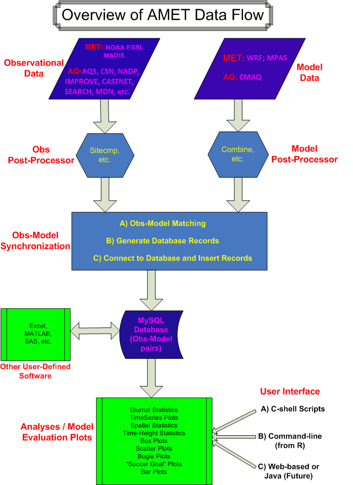

# Atmospheric Model Evaluation Tool (AMET)
## Version 1.4 Beta User’s Guide

-------

## Contents

[1. Overview](#Overview)<br>
&nbsp;&nbsp;&nbsp;&nbsp;[1.1 Overall Objective and Basic Structure](#Basic_Structure)<br>
&nbsp;&nbsp;&nbsp;&nbsp;[1.2 Concept of an AMET “Project”](#AMET_Project)<br>
&nbsp;&nbsp;&nbsp;&nbsp;[1.3 Organization of This User’s Guide](#Users_Guide)<br>
[2. Directory Structure](#Directory_Structure)<br>
[3. Configuration](#Configuration)<br>
&nbsp;&nbsp;&nbsp;&nbsp;[3.1 R Configuration File (amet-config.R)](#Configuration_File)<br>
[4. Datasets](#Datasets)<br>
&nbsp;&nbsp;&nbsp;&nbsp;[4.1 Model Data](#Model_Data)<br>
&nbsp;&nbsp;&nbsp;&nbsp;[4.2 Observational Data](#Observational_Data)<br>
[5. Database Setup](#Database_Setup)<br>
&nbsp;&nbsp;&nbsp;&nbsp;[5.1 AMET Setup](#AMET_Setup)<br>
&nbsp;&nbsp;&nbsp;&nbsp;[5.2 Basic MySQL Commands](#MySQL_Commands)<br>
[6. Project Creation and Database Population](#Project_Creation)<br>
&nbsp;&nbsp;&nbsp;&nbsp;[6.1 The wrfExample Project](#WRF_Project)<br>
&nbsp;&nbsp;&nbsp;&nbsp;[6.2 The aqExample Project](#AQ_Project)<br>
&nbsp;&nbsp;&nbsp;&nbsp;[6.3 Creating a New MET Project](#New_MET_Project)<br>
&nbsp;&nbsp;&nbsp;&nbsp;[6.4 Creating a New AQ Project](#New_AQ_Project)<br>
[7. Analysis](#Analysis)<br>
&nbsp;&nbsp;&nbsp;&nbsp;[7.1 metExample](#metExample)<br>
&nbsp;&nbsp;&nbsp;&nbsp;[7.2 aqExample](#aqExample)<br>
&nbsp;&nbsp;&nbsp;&nbsp;[7.3 Creating a New Analysis Project](#New_Analysis_Project)<br>
[8. Adding a New AQ Network to AMET](#Adding_New_AQ_Network)<br>
[9. CMAS Support for AMET](#CMAS_Support)<br>
[References](#References)<br>
[Appendix A: Overview Flow Diagram](#Appendix_A)<br>
[Appendix B: Configuration and Input Files](#Appendix_B)<br>


## Tables

[Table 2‑1. Directories under $AMETBASE](#Table_2-1)<br>
[Table 3‑1. Most common variables that need to be changed in amet-config.R](#Table_3-1)<br>
[Table 6‑3. aqProject.csh script options](#Table_6-3)<br>
[Table 7‑1. MET analysis scripts](#Table_7-1)<br>
[Table 7‑2. AQ analysis script options](#Table_7-2)<br>
[Table B‑1. amet-config.R](#Table_B-1)<br>
[Table B‑2. MET analysis input variables](#Table_B-2)<br>
[Table B‑3. AQ analysis input variables](#Table_B-3)<br>

<a id="Overview"></a>1. Overview
===========


<a id="Basic_Structure"></a>1.1 Overall Objective and Basic Structure
-------------------------------------
The Atmospheric Model Evaluation Tool (AMET) (Appel et al., 2011) is a suite of software designed to facilitate the analysis and evaluation of predictions from meteorological and air quality models. AMET matches the model output for particular locations to the corresponding observed values from one or more networks of monitors. These pairings of values (model and observation) are then used to statistically and graphically analyze the model’s performance.

More specifically, AMET is currently designed to analyze outputs from the [Weather Research and Forecasting (WRF) model](http://www.wrf-model.org), and the [Community Multiscale Air Quality (CMAQ) model](http://www.epa.gov/cmaq), as well as [Model for Prediction Across Scales (MPAS)](https://mpas-dev.github.io) - a new global model developed by NCAR. Output from other regional and global air quality models, such as the [Comprehensive Air Quality Model with Extensions (CAMx)](http://www.camx.com), can also be formatted for analysis with AMET.

The basic structure of AMET consists of two *fields* and two *processes*.

-   The two fields (scientific topics) are **MET** and **AQ**, corresponding to meteorology and air quality data.

-   The two processes (actions) are **database population** and **analysis**. Database population refers to the underlying structure of AMET; after the observations and model data are paired in space and time, the pairs are inserted into a database (MySQL). Analysis refers to the statistical evaluation of these pairings and their subsequent plotting.

Practically, a user may be interested in using only one of the fields (either MET or AQ), or may be interested in using both fields. That decision is based on the scope of the study. The two main software components of AMETv1.4 are **MySQL** (an open-source database software system) and **R** (a free software environment for statistical computing and graphics). The previous versions of AMET also utilized **Perl** (an open-source cross-platform programming language), but the **Perl** requirement was removed from AMETv1.3 and beyond in an effort to streamline the tool.


<a id="AMET_Project"></a>
1.2 Concept of an AMET “Project”
----------------------------

A central organizing structure for AMET applications is a project. A project groups a particular model simulation (specific model, physics, spatial domain, grid scale, etc.) with all of the AMET database tables that correspond to that simulation, the scripts necessary to populate that database, and the scripts required to analyze that project. For example, you might have one project for a 2011 12-km continental U.S. simulation, and another project for a 2011 4-km Eastern U.S. simulation. A project can be for either MET or AQ, not for both. It is essential that you both uniquely and concisely name each project. It is recommended that you follow the directory structure when creating new projects, by copying one of the example directories (aqExample, metExample) provided with the installation and then renaming it to the new project’s name. For the MET component the example directory will work for both WRF and MPAS.

<a id="Users_Guide"></a>
1.3 Organization of This User’s Guide
---------------------------------

The U.S. EPA and the Community Modeling and Analysis System (CMAS) Center created this guide to assist you in applying the AMET system in your work.

The contents of the remaining sections of this User's Guide are listed below.

-   [Section 2](#Directory_Structure) describes the overall directory structure of the AMET installation.

-   [Section 3](#Configuration) gives instructions on how to configure the R configuration files.

-   [Section 4](#Datasets) is an overview of the various model outputs and observed data
    provided with the AMET release.

-   [Section 5](#Database_Setup) provides instructions on how to create the AMET MySQL database, with
    specific instructions for each of the MET and AQ models. Sample MySQL commands
    are also shown for illustrative SQL queries.

-   [Section 6](#Project_Creation) gives instructions on how to populate the AMET MySQL database, with
    specific instructions for each of the WRF and CMAQ models, and also on how to
    create a new MET project and a new AQ project for subsequent analyses.

-   [Section 7 ](#Analysis) includes instructions on how to perform model evaluation for each of the
    WRF and CMAQ models, and includes an overview of the functionality of all the MET
    and AQ evaluation scripts provided.

***<span style="font-variant:small-caps;">Important note</span>:*** *The set of
analyses/evaluation scripts provided in this release are strictly for illustration
purposes on the functionality/design of AMET, and are not to be construed as a
recommended suite of analyses scripts for model evaluation. We encourage the user
community to use the scripts we have provided as examples as well as a basis to
start developing other analyses scripts and contribute them to the modeling
community to increase AMET functionality.*

-   [Section 8](#CMAS_Support) discusses how to obtain support for AMET from the Community Modeling
    and Analysis System (CMAS) Center ([**http://www.cmascenter.org**](http://www.cmascenter.org)).

-   [Appendix A](#Appendix_A) is an overall flow diagram for AMET and its various components.

-   [Appendix B](#Appendix_B) provides information on the various input files used in AMET. For each
    input file, a table lists brief descriptions of all user-defined variables that can
    be set by the user for a given evaluation.

Before using AMET and this user’s guide, you must first install the AMET package on your
system. For information on the installation process, please see the [Atmospheric Model Evaluation Tool (AMET) Installation Guide](https://github.com/USEPA/AMET/blob/1.4b/docs/AMET_Install_Guide_v14b.md).

<a id="Directory_Structure"></a>
2. Directory Structure
===================

In this guide, the top level of the AMET directory structure is referred to
as “AMETBASE”. This environment variable is actually set in many of the
scripts discussed below. For example, if you were to run the AMET version 1.4b installation Git command in the directory /opt:

```
git clone -b 1.4b https://github.com/USEPA/AMET.git AMET_v14b

```
The setting of AMETBASE would be /opt/AMET_v14b


Table 2-1 shows the directories contained in the $AMETBASE directory.

**Table 2‑1. Directories under $AMETBASE.**<a id="Table_2-1"></a>

| **Directory**         | **Description**                                                       |
|-----------------------|-----------------------------------------------------------------------|
| **bin**               | External executables used by helper scripts.                          |
| **configure**         | Configuration files for R and php.                                    |
| **model\_data**       | Model output data (contains component-specific \[i.e., MET and AQ\] subdirectories). |
| **obs**               | Observational data (e.g., MADIS, discussed in Section 4.2) (contains component-specific \[i.e., MET and AQ\] subdirectories).         |
| **output**            | Output of database population and analysis (contains project-specific subdirectories). |
| **R\_analysis\_code** | R scripts used for statistical analysis.                              |
| **R\_db\_code**       | R scripts used for user and database setup.                           |
| **scripts\_analysis** | Project-specific wrapper scripts and inputs for analysis (contains project-specific subdirectories).|
| **scripts\_db**       | Project-specific wrapper scripts and inputs for database population (contains project-specific subdirectories). |
| **src**               | Source code for third-party software.                                 |


<a id="Configuration"></a>
3. Configuration
=============

After installing the AMET code and data,
the next step is to configure the
AMET system. In the $AMETBASE/configure directory, you will find the R MySQL configuration file `amet-config.R`.

<a id="Configuration_File"></a>
3.1 R Configuration File (amet-config.R)
------------------------------------

The AMET R configuration file is used by the underlying R programs to perform
AMET setup and statistical analysis on pairs of model and observational data. Most users will
need to modify only a few specific lines of this configuration file. The most
common variables to change are shown in Table 3-1.

**Table 3‑1. Most common variables that need to be changed in amet-config.R.**<a id="Table_3-1"></a>

| **Variable**   | **Description** |
|----------------|-----------------|
| **amet_base**           | The base directory where AMET is installed. By default this is read from the environment variable **AMETBASE** and therefore does not need to set explicitly here.|
| **mysql\_server**       | The MySQL server location. Examples are **localhost** if MySQL is installed on the same machine on which you have installed AMET, or **rama.cempd.unc.edu** if you have installed the MySQL server on a remote host called **rama**. |
| **amet\_login**         | Login for the AMET MySQL user. For the purposes of this tutorial, we assume **amet\_login** is set to **ametsecure**. This MySQL user will be created later when you are working through Section 5. To provide additional security, AMET is shipped with permissions that allow this file to be read only by the user. |
| **amet\_pass**          | Password for **ametsecure**, or your **login** (if you changed it from "**ametsecure**"). |
| **maxrec**              | Maximum records to retrieve for any MySQL query (-1 for no limit). Be default, **maxrec** is set to -1. |
| **EXEC_sitex**          | Full path to the **site_compare** executable. Only required if using the AQ side of AMET. |
| **EXEC_sitex_daily**    | Full path to the **site_compare_daily** executable. Only required if using the AQ side of AMET. |
| **bldoverlay\_exe**     | Full path to the **bldoverlay** executable. Only required if using the AQ side of AMET. |

The amet_login and amet_pass variables are MySQL database credentials. The MySQL credentials specified here are always used in the analysis scripts that come with AMET, which require only database read access to function. Therefore, the MySQL user specified here can be limited to read access only. However, these credentials can also be setup to be used by the database loading scripts. For those scripts to work properly, the MySQL user specified must have permission to create databases and tables, in addition to read access. If the setting in the database loading scripts is to read the amet_login and amet_pass variables from the amet-config.R file, those credentials must be for a user with full MySQL permissions.

For simplicity, it is suggested that the MySQL credentials specified in the amet-config.R file be for a user with full database permissions. For database security purposes, it is recommended that **the amet-config.R file be made read-only by the user**.

<a id="Datasets"></a>
4. Datasets
========

The AMET release includes example datasets of both model and observational data.

<a id="Model_Data"></a>
4.1 Model Data
----------

For the model data, we have included both meteorological and air quality
data. We have organized the data into four example projects:
"metExample" and "aqExample". On the MET side, there is a 1-month WRF simulation 
and 1-month MPAS simulation provided for July 2016. We included the same period 
in case users wanted to compare the two models. These are also subsets with only the 
variables needed for the evaluation scripts.

The WRF data consist of 31 WRF output files in netCDF format:

> $AMETBASE/model\_data/MET/**metExample_wrf**/
>
> wrfout\_subset\_2016-07-01\_00:00:00
> ...
> wrfout\_subset\_2016-07-31\_00:00:00

The MPAS data consist of 31 MPAS output files in netCDF format:

> $AMETBASE/model\_data/MET/**metExample_mpas**/
>
> history.subset.2016-07-01.nc
> ...
> history.subset.2016-07-31.nc

Note that we have bolded “metExample_*” in the directory names above to
highlight the fact that we are using the project name to organize the
model output files into directories.

On the AQ side, we have included two CMAQ output files for the period
July 01 2011 0:00 UTC to July 31 2011 23:00 UTC. The two files:

> $AMETBASE/model\_data/AQ/**aqExample**/
>
> AMET_CMAQ_July_2016_Test_Data.aconc
>
> AMET_CMAQ_July_2016_Test_Data.dep

correspond to the concentration and wet deposition output files from
CMAQ, after they have been postprocessed with the combine utility.

All of the spatial domains cover the continental U.S. and have a 12-km
grid resolution.

<a id="Observational_Data"></a>
4.2 Observational Data
------------------

As with the model data, the observations directory structure is divided between MET and AQ fields. On the MET side, all of the observations come from the Meteorological Assimilation Data Ingest System (MADIS), provided by the National Oceanic and Atmospheric Administration (NOAA). Contact MADIS to obtain a MADIS account for downloading these data (see http://www-sdd.fsl.noaa.gov/MADIS for details).

The new autoFTP option in AMET uses the MADIS anonymous FTP account; if using that option, please acknowledge the MADIS group in applications that use AMET. Alternatively, users may also manually download all MADIS observations before the model-observation matching step.

In the AMET directory structure, all of the MADIS data are stored under $AMETBASE/obs/MET. The MADIS observation directory structure is provided in this directory in the release. The AMET example data distribution from CMAS includes standard MET surface observations from MADIS for the model ouput periods (July 2011 and July 2013). To list the contents of the example met observational data directory:

```
ls $AMETBASE/obs/MET
```

Each of the observation files is a netCDF file representing one hour’s worth of surface meteorological data from all available monitoring sites. The netCDF files can be stored in a gzip compressed format to save space, but should be unzipped before use. These files are now directly read during the model-obs matching step instead of using an external utility (e.g.; sfcdump.exe) to extract into text and parsed by Perl.

On the AQ side, example observational data are available for a number of
networks including:
* Air Quality System (AQS) network
* Clean Air Status and Trends Network (CASTNET)
* Interagency Monitoring of PROtected Visual Environments (IMPROVE)
* Mercury Deposition Network (MDN)
* National Atmospheric Deposition Program (NADP)
* SouthEastern Aerosol Research and Characterization Study (SEARCH)
* Chemical Speciation Network (CSN; formerly STN)

The observational datasets
have been preprocessed and reformatted (in some instances from their original
sources) for access by AMET. The temporal range is network dependent.
The monitoring station locations are provided by a series of .csv files
under the subdirectory $AMETBASE/obs/AQ/site\_files. A brief synopsis of
each network, along with the steps taken to create these data for AMET,
is given below.

Note that in the species lists, each line is of the format
“observed species name; model species name (units)”.

### Clean Air Status and Trends Network (CASTNET) Weekly

Weekly CASTNet data are obtained through the CASTNet web site:
[**http://www.epa.gov/castnet/**](http://www.epa.gov/castnet/). Weekly
CASTNet data can be obtained by downloading the “drychem” file under the
prepackaged datasets on the CASTNet web site. No postprocessing of the
downloaded data is necessary in order for them to be compatible with the
Site Compare (sitecmp) software packaged with the AMET system. Note that
the species **MG**, **CA**, **K**, **NA**, and **CL** are available when
using the CMAQ AERO6 module.

*Weekly CASTNet Species used with AMET*:

> tso4; ASO4T (µg/m<sup>3</sup>)<br>
> tno3; ANO3T (µg/m<sup>3</sup>)<br>
> tnh4; ANH4T (µg/m<sup>3</sup>)<br>
> tno3+nhno3; ANO3T+HNO3\_UGM3 (TNO3; µg/m<sup>3</sup>)<br>
> nhno3; HNO3\_UGM3 (µg/m<sup>3</sup>)<br>
> wso2; SO2\_UGM3 (µg/m<sup>3</sup>)<br>
> MG; AMGJ (µg/m<sup>3</sup>)<br>
>  CA; ACAJ (µg/m<sup>3</sup>)<br>
> K; AKJ (µg/m<sup>3</sup>)<br>
> NA; ANAIJ (µg/m<sup>3</sup>)<br>
> CL; ACLIJ (µg/m<sup>3</sup>)<br>

### Clean Air Status and Trends Network (CASTNet) Hourly

Hourly CASTNet data are obtained through the CASTNet web site:
[**http://www.epa.gov/castnet/**](http://www.epa.gov/castnet/). Hourly
CASTNet ozone data can be obtained by downloading the files labeled
“ozone\_yyyy” under the prepackaged datasets on the CASTNet web site.
Additionally, a “metdata\_yyyy” file is also available on the CASTNet
web site, which contains several meteorological variables in addition to
ozone. No postprocessing of the downloaded data is necessary in order
for them to be compatible with AMET’s sitecmp.

*Hourly CASTNet Species used with AMET*:

> Ozone; ozone (ppb)

*Additional species that could be used with AMET:*

> Surface Temperature Precipitation<br>
> Relative Humidity 10m Wind Speed<br>
> Solar Radiation 10m Wind Direction

### Interagency Monitoring of PROtected Visual Environments (IMPROVE)

IMPROVE data are obtained through the IMPROVE web site:
[**http://vista.cira.colostate.edu/improve/**](http://vista.cira.colostate.edu/improve/).
The IMPROVE web site links to the Visibility Information Exchange Web
System (VIEWS) web site, which is an interactive system for downloading
various air-quality-related data. IMPROVE data obtained through the
VIEWS system do not require any additional processing to work with
AMET’s sitecmp.

*IMPROVE Species used with AMET*:

> SO4f\_val; ASO4T (µg/m<sup>3</sup>)<br>
> NO3f\_val; ANO3T (µg/m<sup>3</sup>)<br>
> NH4f\_val; ANH4T (µg/m<sup>3</sup>)<br>
> MF\_val; PM25 (µg/m<sup>3</sup>)<br>
> OCf\_val; PM\_OC (µg/m<sup>3</sup>)<br>
> ECf\_val; AECT (µg/m<sup>3</sup>)<br>
> OCf\_val+ECf\_val; PM\_OC+AECT (TC; µg/m<sup>3</sup>)<br>
> CHLf\_val; ACLIJ (µg/m<sup>3</sup>)<br>
> MT\_val; PM10 (µg/m<sup>3</sup>)<br>
> CM\_calculated\_val; PMC_TOT (µg/m<sup>3</sup>)<br>
> NAf\_val; ANAIJ (µg/m<sup>3</sup>)<br>
> NAf\_val+CHLf\_val; ANAIJ+ACLIJ (NaCl; µg/m<sup>3</sup>)<br>
> FEf\_val; AFEJ (µg/m<sup>3</sup>)<br>
> ALf\_val; AALJ (µg/m<sup>3</sup>)<br>
> SIf\_val; ASIJ (µg/m<sup>3</sup>) <br>
> TIf\_val; ATIJ (µg/m<sup>3</sup>)<br>
> CAf\_val; ACAJ (µg/m<sup>3</sup>)<br>
> MGf\_val; AMGJ (µg/m<sup>3</sup>)<br>
> Kf\_val; AKJ (µg/m<sup>3</sup>)<br>
> MNf\_val; AMNJ (µg/m<sup>3</sup>)<br>
> 2.20\*ALf\_val+2.49\*SIf\_val+1.63\*CAf\_val+2.42\*FEf\_val+1.94\*TIf\_val; ASOILJ (µg/m<sup>3</sup>)<br>
 MF\_val-SO4f\_val-NO3f\_val-0.2903\*NO3f\_val-0.375\*SO4f\_val-OCf\_val-ECf\_val-NAf\_val-CHLf\_val-2.2*\ALf\_val-2.49\*SIf\_val-1.63\*CAf\_val-2.42\*FEf\_val-1.94\*TIf\_val; AUNSPEC1IJ (OTHER; µg/m<sup>3</sup>)<br>
> ; ANCOMIJ (NCOM; µg/m<sup>3</sup>)<br>
> ; AUNSPECIJ2 (OTHER_REM; µg/m<sup>3</sup>)

### Mercury Deposition Network (MDN)

MDN data are obtained through the NADP/MDN network web site:
[**http://nadp.sws.uiuc.edu/mdn/**](http://nadp.sws.uiuc.edu/mdn/). Data
are available for download as a comma-delimited file for all sites. No
postprocessing of the downloaded data is necessary in order for them to
be used with AMET’s sitecmp.

*MDN Species used with AMET* (from CMAQ deposition file):

> HGconc; TWDEP\_HG (ng/L)<br>
> HGdep; TWDEP\_HG (µg/m<sup>2</sup>)

### National Atmospheric Deposition Program (NADP)

NADP data are obtained through the NADP/NTN web site:
[**http://nadp.sws.uiuc.edu/**](http://nadp.sws.uiuc.edu/). Weekly wet
concentration data are downloaded in comma-delimited format directly
from the NADP web site. No postprocessing of the downloaded data is
necessary in order for them to be used with AMET’s sitecmp.

*NADP Species used with AMET* (from CMAQ deposition file):

> Valcode<br>
> Invalcode<br>
> NH4; WDEP\_NHX (mg/L or kg/ha)<br>
> NO3; WDEP\_TNO3 (mg/L or kg/ha)<br>
> SO4; WDEP\_ASO4T (mg/L or kg/ha)<br>
> Cl; WDEP\_TCL (mg/L or kg/ha)<br>
> Na; WDEP\_ANAJK (mg/L or kg/ha)<br>
> Ca; WDEP\_CAJK (mg/L or kg/ha)<br>
> Mg; WDEP\_MGJK (mg/L or kg/ha)<br>
> K; WDEP\_KJK (mg/L or kg/ha)<br>
> precip; RT (mm)

### SouthEastern Aerosol Research and Characterization (SEARCH) Study

SEARCH data are obtained through the SEARCH web site:
[**http://www.atmospheric-research.com/public/index.html**](http://www.atmospheric-research.com/public/index.html).
The SEARCH data can be downloaded as comma-delimited files for each
SEARCH site. In order to be used with sitecmp and AMET, the individual
site files must first be merged together into a single file. The example
SEARCH data file provided with AMET should serve as an example of how
the raw SEARCH data need to be combined and formatted in order to work
with sitecmp and AMET. The list of SEARCH species listed here is just an
example of the species available from SEARCH, as the exact species
available varies depending on year and whether the data are hourly or
daily. AMET formatted SEARCH data files are available for download from
the CMAS website.

*SEARCH Species used with AMET*:

> o3; O3 (ppb)<br>
> co; CO (ppb)<br>
> so2; SO2 (ppb)<br>
> no; NO (ppb)<br>
> hno3; HNO3 (ppb)<br>
> teom; PM25 (µg/m<sup>3</sup>)<br>
> no3; ANO3T (µg/m<sup>3</sup>)<br>
> so4; ASO4T (µg/m<sup>3</sup>)<br>
> nh4; ANH4T (µg/m<sup>3</sup>)<br>
> noy; NOY (ppb)

### Chemical Speciation Network (CSN)

CSN data are obtained through the EPA’s Air Quality System
(AQS), located at
[**http://www.epa.gov/ttn/airs/airsaqs/**](http://www.epa.gov/ttn/airs/airsaqs/).
The data provided with AMET are a sample of the CSN data that can be
obtained through the AQS. Some postprocessing of the downloaded CSN data
is necessary in order for them to work with sitecmp and AMET. However, AMET
compatible CSN data files are available from the CMAS website.

*CSN Species used with AMET*:

> m\_so4; ASO4T (µg/m<sup>3</sup>)<br>
> m\_no3; ANO3T (µg/m<sup>3</sup>)<br>
> m\_nh4; ANH4T (µg/m<sup>3</sup>)<br>
> FRM PM<sub>2.5</sub> Mass; PM<sub>2.5</sub> (µg/m<sup>3</sup>)<br>
> oc\_adj; PM\_OC (µg/m<sup>3</sup>)<br>
> ec\_niosh; AECT (µg/m<sup>3</sup>)<br>
> oc\_adj+ec\_niosh; PM\_OC+AECT (TC; µg/m<sup>3</sup>)<br>

### Air Quality System (AQS)

AQS data are obtained through the EPA’s Air Quality System
(AQS), located at
[**http://aqsdr1.epa.gov/aqsweb/aqstmp/airdata/download_files.html**](http://aqsdr1.epa.gov/aqsweb/aqstmp/airdata/download_files.html).
Various species of atmospheric gases are available for download through
the AQS. THe pre-generated files on this site need to be combined into a
single data file in order to work best with AMET. AMET compatible AQS data
files are available for download from the CMAS website.

*Hourly AQS species used with AMET:*

> O3; O3 (ppb)<br>
> NO; NO (ppb)<br>
> NOY; NOY (ppb)<br>
> NO2; NO2 (ppb)<br>
> NOX; NO+NO2 (NOX, ppb)<br>
> CO; CO (ppb)<br>
> SO2; SO2 (ppb)<br>
> PM25; PMIJ (ug/m3)<br>
> PM10; PM10 (ug/m3)<br>
> Isoprene; ISOP (ppb)<br>
> Ethylene; ETH (ppb)<br>
> Ethane; ETHA (ppb)<br>
> Toluene; TOL (ppb)<br>
> Temperature: SFC_TMP (C)<br>
> RH; RH (%)<br>
> Wind_Speed; WSPD10 (m/s)<br>
> ; PBLH (m)<br>
> ; SOL_RAD (watts/m2)<br>
> ; 10*precip (mm/hr)

*Daily AQS species used with AMET:*

>PM25; PMIJ (ug/m3)<br>
> PM10; PM10 (ug/m3)<br>
> Isoprene; ISOP (ppb)<br>
> Ethylene;ETH (ppb)<br>
> Ethane; ETHA (ppb)<br>
> Toluene; TOL (ppb)<br>
> Acetaldehyde; ALD2 (ppb)<br>
> Formaldehyde; FORM (ppb)<br>
> OC+OC_Blank; AOCIJ (ug/m3)<br>
> EC,ug/m3; AECIJ (ug/m3)<br>
> OC+OC_Blank+EC; AOCIJ+AECIJ (ug/m3)<br>
> Na; ANAIJ (ug/m3)<br>
> Cl; ACLIJ (ug/m3)<br>
> Na+Cl; ACLIJ+ANAIJ (ug/m3)<br>
> SO4; ASO4IJ (ug/m3)<br>
> NO3; ANO3IJ (ug/m3)<br>
> NH4; ANH4IJ (ug/m3)<br>
> Fe; AFEJ (ug/m3)<br>
> Al; AALJ(ug/m3)<br>
> Si; SIJ (ug/m3)<br>
> Ti; ATIJ (ug/m3)<br>
> Ca; ACAJ (ug/m3)<br>
> Mg; AMGJ (ug/m3)<br>
> K; AKJ (ug/m3)<br>
> Mg; AMNJ (ug/m3)<br>
> 2.2\*Al+2.49\*Si+1.63\*Ca+2.42\*Fe+1.94\*Ti; ASOILJ (soil, ug/m3)<br>
> PM25-SO4-NO3-NH4-OC-EC-[Na]-[Cl]-2.2\*Al-2.49\*Si-1.63\*Ca-2.42\*Fe-1.94\*Ti; AUNSPEC1IJ (OTHER, ug/m3)<br>
> 0.8\*OC; ANCOMIJ (NCOM, ug/m3)<br>
> PM25-SO4-NO3-NH4-OC-EC-[Na]-[Cl]-2.2\*Al-2.49\*Si-1.63\*Ca-2.42\*Fe-1.94\*Ti-0.8\*OC; UNSPEC2IJ (OTHER_REM, ug/m3)<br>

<a id="Database_Setup"></a>
5. Database Setup
==============

This section describes how to set up the MySQL database. Please
refer to the flow diagram in [Appendix A](#Appendix_A) to understand the overall flow
of data among the various modules within AMET. This section must be
completed before you populate the database with your project-specific
data ([Section 6](#Project_Creation)). This setup process is required only once for a given
AMET installation. There are separate setup procedures for the two
fields, MET and AQ. If you are using AMET for only one of those fields,
you need to run only the corresponding setup. If you are running AMET
for both fields, you will need to run both setups. In the following
discussion, we assume the default name of the AMET MySQL user is
“ametsecure”. If you decide to change the AMET database user or password, then you will
need to update the appropriate variables in the R configuration files
in the directory $AMETBASE/configure (see Section 3). Before you run
the setup scripts, you will need to know the “root” password for the
MySQL administrator. Note that this is not necessarily the same as the “ametsecure”
password that will be created using the scripts discussed below.

Note that the database is required for the meteorological side of AMET. 
However, as of AMETv1.4, the database is no longer required to process and 
analyze air quality data. An option has been added to read the csv output
files from site compare directly, bypassing the need to use the database. This has 
both advantages and disadvantages. The primary advantage is that an AMET user would 
not be required to install and setup the MySQL database for AMET, eliminating and 
streamlining the AMET install process somewhat. The primary disadvantages 
is that all output files must be retained and organized, as they are needed 
to do any analysis. Also, the use of the database provides the ability to fully 
query and subset the AQ data in the database using the metadata provided. This 
functionality would be highly limited without the use of the database. It is up 
to the user to choose whether or not to install and utilize the database. However, 
keep in mind that the database is still required to process and analyze 
meteorological data.

The instructions provided below assume the use of the MySQL database. If only
processing AQ data and not employing the use of the database, those portions of
the instructions that deal with setuping up and interfacing with the database
can be ignored.

<a id="AMET_Setup"></a>
5.1 AMET Setup
---------

Go to the AMET database setup directory

```
cd $AMETBASE/scripts_db/dbSetup
```

To create an AMET user, you will need to edit and run the
create\_amet\_user.csh script. Confirm that the
value of **AMETBASE** in this script corresponds to the AMET installation on your system. Run this script to set up the AMET database:

```
./create_amet_user.csh
```

After executing the script you will be prompted for MySQL’s “root” password. The MySQL root user must
have permission to create and modify user. It will then set up the AMET user,
here assumed to be “ametsecure”.

The dbSetup directory also contains a script for removing the amet user and database.
To delete a specific AMET database, edit and run the delete\_db.csh script,
setting the $AMETBASE and $AMET_DATABASE variables to specify the database to be
removed.

```
./delete_db.csh
```

After executing the script you will be prompted for MySQL’s “root” password. *Use this script with **EXTREME CAUTION** because this will
delete all of the data in the database corresponding to **all** of the
projects (**both MET and AQ**).*

<a id="MySQL_Commands"></a>
5.2 Basic MySQL Commands
--------------------

As you proceed through the amet database setup and the
project-specific database populate process, you may want to query the
database directly using command line SQL commands. Here are a few commands to help
you interact directly with the MySQL amet database. For more specifics,
see one of the many MySQL books available, or look at the documentation
under [**http://dev.mysql.com/doc**](http://dev.mysql.com/doc).

To log onto the MySQL server from the command line:

```
$ mysql -u ametsecure -D amet –p
```

This will give you a MySQL prompt (“mysql&gt;“). Note that all MySQL
commands are case insensitive, and they must end with a semicolon (“;”).

To get a list of all the tables in your database

```
mysql> show tables;
```

After you have populated all of the example projects (end of Section 6),
that command will yield a table like this:

```
+---------------------+

| Tables\_in\_amet |

+---------------------+

| aqExample |

| aq\_project\_log |

| project\_log |

| project\_units |

| site\_metadata |

| stations |

| metExample\_surface |

| metExample\_raob |

+---------------------+
```

To select every column and row in your project\_log table:

```
mysql> select \* from project\_log;
```

To select the latitude, longitude, and common name columns from the
stations metadata table and limit the results to the first 20 rows:

```
mysql> select lat,lon,common\_name from stations limit 20;
```

To select all station metadata where the monitor is from the CASTNET
network:

```
mysql> select \* from site\_metadata where network=‘castnet’;
```

To determine which networks are included in the aqExample project:

```
mysql> select distinct network from aqExample;
```

Note: It is wise for users to understand simple queries like this or to download an interactive MySQL database tool as a means to look at the database, table structure and even sample data therein in the case of problems.

<a id="Project_Creation"></a>
6. Project Creation and Database Population
========================================

The database population phase of AMET must be performed for each new
project. As discussed in Section 1.2, the *project* is the organizing
structure used to group a particular model simulation with the
scripts and data used to populate the AMET tables. Navigate to the
database populate directory by typing

```
cd $AMETBASE/scripts_db
```

This directory contains two project directories and one input files directory, in
addition to the dbSetup directory described earlier. The projects are

* metExample_wrf/metExample_mpas: MET examples for the WRF and MPAS models
* aqExample: an AQ example for the CMAQ model

In the following subsections, we describe how to run each project.

<a id="MET_Project"></a>
6.1 The metExample Projects
----------------------

Go to the metExample_wrf project directory. Note these are the same steps for metExampe_mpas.

```
cd $AMETBASE/scripts_db/metExample_wrf
```

The C-shell file matching_surface.csh is a wrapper script for calling the R
MET_matching_surface.R that actually populates the AMET database with the project data.
Verify that the variable AMETBASE is set to the correct AMET project. The example script has detailed instructions on all variables that are passed to R. Modify according to your setup and run the script by typing

```
./matching_surface.csh >& log.populate
```
After executing the script you will be prompted for MySQL’s “root” password. The script can be configured to not prompt for a password by adding the variable `password` to the script and setting it to the MySQL "root" pass. This non-interactive option is useful for batch processing or for enabling the script to run in the background.

This C-shell script for surface meteorology will create an empty project tables in the AMET
database: wrfExample_\wrf\_surface. It is important to understand that if users specify a database 
via AMET_DATABASE that is not present on the MySQL server, a new database will automatically
be created. The wrfExample_\wrf\_surface table contains the matches between the model outputs 
and surface observations. After creating the table, the script then excutes the matching process. 
This process consists of retreiving data from the MADIS web site for the model’s temporal
period, unzipping the downloaded data, finding the geographic location of each observation
site on the model grid and interpolating to those locations, populating the
appropriate table with the model-obs pairs for each variable, and optionally rezipping
the data for compressed storage. Finally, the script updates the project\_log
with summary information for the wrfExample project.

<!----
The second C-shell file, metFTP.csh, is a wrapper script for calling
Perl programs to download observational data from MADIS for a specific
period of time. This allows you to download observational data without
having the model output. Make sure the variable auto\_ftp is set to 1
when running this script. Please note that the MADIS data need to be
downloaded once for a given time period and will subsequently be
available to all projects.
--->

<a id="AQ_Project"></a>
6.2 The aqExample Project
---------------------

Go to the AQ example project directory:

> $ cd $AMETBASE/scripts\_db/aqExample

Here you will see one C-shell script and the combine subdirectory. 
The combine subdirectory is not used for this example; 
it is discussed later in Section 6.4, “Creating a New AQ Project”.

The C-shell file aqProject.csh is a wrapper script for calling the R
programs that actually create an AMET AQ project (and database if necessary)
and populate the AMET database with the project data.

Verify that the variable AMETBASE is set to the correct AMET project.   Run the script by typing

```
./aqProject.csh >& log.populate
```

After executing the script you will be prompted for MySQL’s “root” password. The script can be configured to not prompt for a password by adding the variable `password` to the script and setting it to the MySQL "root" pass. This non-interactive option is useful for batch processing or for enabling the script to run in the background. By default, the script is setup to prompt you for the MySQL login/password.

This C-shell script will create the AMET database (if it doesn't already
exist), three required AQ database tables (i.e. project_units, site_metadata and
aq_project_log), and one empty project table in the AMET database: aqExample.
After creating this table, the script then begins the matching process. This
consists of calling a series of Fortran helper programs. The two Fortran helper
programs are $AMETBASE/bin/sitex\_daily.exe and $AMETBASE/bin/sitex_daily_O3.exe;
the first one matches the AQS network’s data to the nearest grid cell in the CMAQ
model, and the second one does the same for the other networks. These programs need
to be downloaded and built (and the path to the excutable specified in the
amet-config.R file before running the aqProject.csh script. After each network
has been matched to the model, the aqExample table is populated with the model-obs
pairs. In addition to creating and populating the aqExample table, the script
updates the project\_units table with each network for that project. This table
defines the physical units of the species variables for this network (e.g., ppb vs.
µg/m<sup>3</sup>). Finally, the script updates the aq\_project\_log with
summary information for the aqExample project.


<a id="New_MET_Project"></a>
6.3 Creating a New MET Project
--------------------------


When you create your own projects, we recommend that you utilize the
AMET convention of naming your directories after your projects. If you choose
not to do this, you will have to modify the provided run scripts to suite your own needs.

To create a new project, follow these basic steps:

1.  Copy the appropriate example project (metExample) to a new directory name (see below).

2.  Rename these directories after your new project (use the *exact* project name, as
    many scripts use the project name to navigate directories and organize analyses).

3.  Create a new project directory under $AMETBASE/model\_data/MET for
    the model output files. In most cases you will want to link in model outputs from an 
    archive or work directory. This also serves to keep model outputs organized.

4.  Configure the C-shell script matching_surface.csh for the new project.

5.  Run the matching_surface.csh script to populate the AMET database.


*TIP: Name the directory of each new project the same name as the AMET_PROJECT
variable in the database and analysis scripts.*


For example, to create a new WRF project called “wrfNC2007”,
use the following commands:

> $ cd $AMETBASE/scripts\_db
>
> $ cp -r metExample wrfNC2007
>
> $ cd wrfNC2007


```
cd $AMETBASE/scripts_db
cp -r metExample wrfNC2007
```
Create a new model data directory and move or link model data into
it, as follows:

```
cd $AMETBASE/model_data/MET
mkdir wrfNC2007
cd wrfNC2007
ln -s <model data directory> .
```

Here, you would replace “&lt;model data&gt;” with the path to your model
data file(s). The matching_surface.csh script (or soon to come matching_profiler.csh, matching_acars.csh, 
matching_raob.csh, matching_surfrad.csh and matching_prism.csh) will perform the model-obs
matching of all model outputs in this new project directory.

Next, edit the $AMETBASE/script\_db/wrfNC2007/matching_surface.csh variables
AMET\_PROJECT ("wrfNC2007") and RUN\_DESCRIPTION (your description of
the project).

Finally, run the surface model-obs matching script (or others):

```
cd $AMETBASE/scripts\_db/wrfNC2007
./matching_surface.csh |& tee matching.wrfNC2007.log
```

The matching_surface.csh script will create a new MET project in the AMET database if
it does not exist (a new database will also be created if it does not already exist). Specifically,
it will create a new row in the AMET project\_log table and three new tables: 
wrfNC2007\_profiler, wrfNC2007\_raob, and wrfNC2007\_surface. Once this script completes,
the AMET database will be ready to produce meteorology model performance analysis plots and statistics.

<a id="New_AQ_Project"></a>
6.4 Creating a New AQ Project
-------------------------


Before illustrating the creation of a new AQ project,
the relationship between model species and
monitor species will be described. In order for AQ database population to work, there must
be a mapping between the model species and the various observational network species.
This mapping is accomplished through a combination of post-processing the CMAQ model data and
species formulas in the AQ_species_list.input file, which is located in the
$AMETBASE/scripts\_db/input_files directory. The model data used in the
aqExample project (Section 6.3) have already been post-processed.
For a new project, the CMAQ data will need to be post-processed before they
are ingested into the AMET database. This post-processing is accomplished
by using the Fortran program `Combine`.

*TIP: Name the directory of each new project the same name as the AMET_PROJECT
variable in the database and analysis scripts.*

To create a new AQ project, follow these basic steps:

1.  Copy $AMETBASE/scripts_db/aqExample to a new directory with the name of the new project.

2.  Post-process the model data using the Fortran program `Combine`.

3.  Create a new project directory under $AMETBASE/model\_data/AQ for
    the input model data and copy or link post-processed model data to this directory.

4.  Configure the C-shell script aqProject.csh for the new project.

5.  Run the aqProject.csh script to populate the AMET database.

For example, to create a new AQ project called “aqNC2007”, use the following commands:

```
cd $AMETBASE/scripts_db
cp -r aqExample aqNC2007
```

Next, create a new model data directory and move or link
post-processed model data into it, as follows:

```
cd $AMETBASE/model_data/AQ
mkdir aqNC2007
cd aqNC2007
ln -s <model data directory> .
```

Replace “&lt;model data directory&gt;” in this example with the path to
post-processed model data file(s) output from `Combine`.

The program `Combine` is used to post-process
CMAQ (and CAMx) I/O API-netCDF formatted files for pairing with observational data. The source code and scripts
for `Combine` are available in the [CMAQ GitHub repository](https://github.com/USEPA/CMAQ/tree/5.2).

For detailed instructions on using `Combine`, see
[**https://github.com/USEPA/CMAQ/tree/5.2/POST/combine**](https://github.com/USEPA/CMAQ/tree/5.2/POST/combine).

After installing the model data in the AMET directories, configure the $AMETBASE/scripts\_db/aqProject.csh
script. The aqProject.csh script does several things:

* Creates a project table in the AMET database (if requested). It will also create the database if it does not already exist. 
* Creates, writes and runs site compare run scripts for each requested network. This step is required regardless of whether or not you plan to you the MySQL database.
* Populates that database with the model and observational data from the site compare scripts. This step can also be skipped if you do not plan on using the database.

The configuration options for the aqProject.csh script are documented in the script and briefly described below. Upon execution, the script
calls several R scripts to run the Fortran program `Site Compare` and then populates the AMET database (assumed AMET\_DB = T) with
paired model-observation data. As this script will be used for setting up different AMET-AQ projects, it will likely only need to be
fully configured once and then reused with little modification for future projects.

Set the following variables to configure the aqProject.csh script for a new project.
* Set **AMETBASE** to the root AMET installation directory for the project.
* Set **AMET_DATABASE** to the name of the database to use (by default this is set to "amet"). This does not need to be set if not using the database.
* Set **MYSQL_CONFIG** to the AMET R configuration file. This does not to be set regardless of whether or not you are using the database since it contains the paths to the site compare executables. However, you do not need to specify the database information if you do not plan to use the database.
* If desired, you can specify the MySQL login information using the **mysql_login** and **mysql_password** variables. If these variables are set to "config_file" the login information will be taken from the amet-config.R file. If you comment out these variables, the script will prompt you for the MySQL login and password.
* Set **AMET_PROJECT** to the name of the AMET project; this should be the same name as the project directory, it needs to be
unique and contain no spaces. This is required.
* Set the AQ **MODEL_TYPE** (e.g. "CMAQ" or "CAMx"). Not required when not using the database.
* Set **RUN_DESCRIPTION** to a short description of the AMET project. Not required when not using the database.
* The variable **USER_NAME** will default to the system user ID and can be changed as desired. The **USER_NAME**
is only used to identify you in the AMET database and is not used to as a login to the
 database. Not required when not using the database.
* Set **EMAIL_ADDR** to associate and email address with the project.  This
setting is not currenlty used for anything in AMET and is simply stored along with the
project information. Not required when not using the database.

The Table 6-3 below describes the other options and file locations that need to be
specified in the aqProject.csh script.<a id="Table_6-3"></a>

| **Variable**   | **Description**                                                                                                                                                                                                                                                                                                                                                                  |
|----------------|----------------------------------------------------------------------------------------------------------------------------------------------------------------------------------------------------------------------------------------------------------------------------------------------------------------------------------------------------------------------------------|
| **AMET\_OBS**              | Top of the AQ observation data directory (defaults to **$AMETBASE/obs/AQ**) |
| **SITE\_META\_LIST**       | Input file containing the list of AQ site meta data files (default is **$AMETBASE/scripts\_db/input\_files/sites\_meta.input**) |
| **AQ\_SPECIES\_FILE**    | Full path the AMET_species_list.R file for mapping the CMAQ species to the observed species for each network. By default this is set to **$AMETBASE/scripts\_db/input\_files/AMET\_species\_list.input** |
| **AMET\_OUT**              | Output directory where post-processed data files will be written. Default is **$AMETBASE/output/$AMET\_PROJECT/sitex_output** |
| **WRITE\_SITEX**           | T/F; Write the individual site compare scripts for each network.  |
| **RUN\_SITEX**             | T/F; Execute the site compare scripts for each network. |
| **LOAD\_SITEX**            | T/F; Load the output from the site compare scripts into the amet database. Set to F if not using the database. |
| **UPDATE\_PROJECT**        | T/F; Flag to update project. Setting to T will re-write project info (i.e. description, user_name, email) but not affect any existing data in the database. Only applicable if using the database. |
| **REMAKE\_PROJECT**        | T/F; Flag to remake project table. Setting to T will re-create an existing project, deleting any data that has been previously loaded but retaining the project table for future use, so use with caution. Only applicable if using the database. |
| **DELETE\_PROJECT**        | T/F; Flag to delete project table. Setting to T will delete an existing project, deleting any data that has been previously loaded and the table entirely, so use with caution. Only applicable if using the database. |
| **INC\_AERO6\_SPECIES**    | T/F; Flag to indicated whether or not to include CMAQ AERO6 species (e.g. Fe, Si, Mg, etc.). Typically set to T for CMAQ simulations that utilized the AERO6 module. |
| **INC\_CUTOFF**            | T/F; Flag to process species using the sharp PM2.5 cutoff in addition to the stardard I and J mode calculation of PM2.5 (these species must be calculated using combine). By default this flag is set to F and is considered an advanced user option. |
| **TIME\_SHIFT**            | T/F; Flag to indicate by how much to time shift the data in site compare. Typically this flag will be set to 1 if the ACONC files have been time shifted. Otherwise, this flag is set to 0. For the example data, no timeshifting of the ACONC files was applied, therefore this flag is set to 0 by default for the example case. |
| **START\_DATE**            | Start date in YYYYJJJ to begin the processing. By default this is set to 2011182 (July 1, 2011) for the example case. |
| **END\_DATE**              | End date in YYYYJJJ to begin the processing. By default this is set to 2011213 (August 1, 2011) for the example case. |
| **CONC\_FILE\_\***         | Path to the CMAQ combined file containing the gas and aerosol species, where * is a number starting at 1. You can specify up to ten CONC files to include, numbered sequentially from 1 to 10. By default this is set to point to the example model data in **$AMETBASE/model_data/AQ/test.12km.conc**|
| **DEP\_FILE\_\***          | Path to the CMAQ combined file containing the wet and dry species, where * is a number starting at 1. You can specify up to ten CONC files to include, numbered sequentially from 1 to 10. By default this is set to point to the example model data in **$AMETBASE/model_data/AQ/test.12km.dep** |
| **CASTNET**                | T/F; Flag to include the CASTNET weekly data in the analysis |
| **CASTNET\_HOURLY**        | T/F; Flag to include the CASTNET hourly data in the analysis |
| **CASTNET\_DAILY\_O3**     | T/F; Flag to include the CASTNET daily O3 (e.g. MDA8 O3) data in the analysis |
| **IMPROVE**                | T/F; Flag to include the IMPROVE daily data in the analysis |
| **NADP**                   | T/F; Flag to include the NADP weekly deposition data in the analysis |
| **CSN**                    | T/F; Flag to include the CSN daily data in the analysis |
| **AQS\_HOURLY**            | T/F; Flag to include the AQS hourly data in the analysis |
| **AQS\_DAILY\_O3**         | T/F; Flag to include the AQS daily O3 (e.g. MDA8 O3) data in the analysis |
| **AQS\_DAILY**             | T/F; Flag to include the AQS daily data in the analysis |
| **SEARCH\_HOURLY**         | T/F; Flag to include the SEARCH hourly data in the analysis |
| **SEARCH\_DAILY**          | T/F; Flag to include the SEARCH daily data in the analysis |
| **NAPS\_HOURLY**           | T/F; Flag to include the NAPS hourly data in the analysis |
| **CASTNET\_DRYDEP**        | T/F; Flag to include the CASTNET dry deposition data in the analysis |
| **AIRMON**                 | T/F; Flag to include the AIRMON data in the analysis |
| **AMON**                   | T/F; Flag to include the AMON data in the analysis |
| **MDN**                    | T/F; Flag to include the MDN data in the analysis |
| **FLUXNET**                | T/F; Flag to include the FLUXNET data in the analysis |
| **AIRBASE\_HOURLY**        | T/F; Flag to include the AIRBASE hourly data in the analysis |
| **AIRBASE\_DAILY**         | T/F; Flag to include the AIRBASE daily data in the analysis |
| **AURN\_HOURLY**           | T/F; Flag to include the AURN hourly data in the analysis |
| **AURN\_DAILY**            | T/F; Flag to include the AURN daily data in the analysis |
| **EMEP\_HOURLY**           | T/F; Flag to include the EMEP hourly data in the analysis |
| **EMEP\_DAILY**            | T/F; Flag to include the EMEP daily data in the analysis |
| **AGANET**                 | T/F; Flag to include the AGANET data in the analysis |
| **ADMN**                   | T/F; Flag to include the ADMN data in the analysis |
| **NAMN**                   | T/F; Flag to include the NAMN data in the analysis |
| **O3\_OBS\_FACTOR**        | Factor to apply to ozone observations, typically used to convert units. By default this is set to 1. |
| **O3\_MOD\_FACTOR**        | Factor to apply to ozone model data, typically used to convert units. By default this is set to 1. |
| **O3\_UNITS**              | ppb/ppm; Ozone units used. By default this is set to ppb.
| **PRECIP\_UNITS**          | mm/cm; Precip units used. By default this is set to cm.

After configuring the aqProject.csh script, it can be run to load the air quality model and observation data to the AMET database:

```
cd $AMETBASE/scripts_db/aqNC2007
./aqProject.csh |& tee populate.aqNC2007.log
```

This will create a new AQ project in the AMET database. Specifically, it
will create a new row in the aq\_project\_log table, a series of new
rows (one for each network) in the project\_units table, and a new
project table called aqNC2007.

<a id="Analysis"></a>
7. Analysis
========

The analysis capabilities of AMET consists of performing statistical analyses
on the model-obs pairs and creating plots of the resulting statistics.
The basic process is to query the project’s database table(s) using a
set of SQL criteria; to perform statistical analyses on the returned
data; and to create plots, tables, and text file outputs. The
AMET installation contains a series of preprogrammed statistical analysis and
plotting routines, based on the R language. These scripts are provided
strictly as a starting point and as illustrative examples. Because all
the model-obs pairs are stored in a MySQL database, an advanced user can
decide to access those data in any desired manner, including other
software packages. All that is required is a MySQL interface and some
exploration of the table structure. We encourage advanced users to
extend these R scripts to create more specific or advanced plotting
capabilities, to use other languages to expand AMET analysis
capabilities, and to contribute these updates to the CMAS community.

As with the database population routines, a project is the organizing
structure used to group a particular model run (specific model,
physics or chemistry, spatial domain, scale, etc.) with the scripts used
to analyze the AMET tables and with the output from the analysis (plots
and data).

Example air quality and met analysis scripts are located in $AMETBASE/scripts/analysis/aqExample and $AMETBASE/scripts/analysis/metExample, respectively.
Within each of these directories there are C-shell
scripts and a subdirectory called **input_files** containing an input file with
similar names as the scripts (e.g., run\_timeseries.csh and timeseries.input). These two
files set up everything that is necessary to configure and run the underlying AMET analysis R script (located in
$AMETBASE/R_analysis_code). The use of the C-shell interface
allows users who are not very familiar with R to perform a set of predefined
analyses with AMET.

<a id="metExample"></a>
7.1 metExample
----------

Use the following command to navigate to the met analysis example project directory:

```
cd $AMETBASE/scripts_analysis/metExample
```

This directory contains a series of C-shell scripts and their accompanying
input files (./input_files/ directory). There are detailed comments in the analysis scripts describing the main configuration options in the script. Other configuration options are set in the files under the ./input_files directory; the settings in these scripts are for fine tuning the AMET plots and typically do not need modification. Some of these other settings include color scales, text output options, and Quality Control limits. The settings for the met analysis scripts are all detailed in [Appendix B](#Appendix_B) [Table B-2](#Table_B-2).

The run\_spatial\_surface.csh script is used here as an example of how to run the analysis scripts. This particular script creates a series of maps comparing the surface monitors to the model for a specificed period (date start/end). Each plot provides color-coded model performance metrics (RMSE, MAE, Bias, Correlation/Index of Agreement) at each of the monitor locations.

Edit the run\_spatial\_surface.csh file and change the AMETBASE variable to the root AMET installation directory on your system. Set the location of the amet-config.R file; the default location is in the $AMETBASE/configure directory.  As noted previously in this guide, the settings in this file could be secured by limiting the read access to only the user. Alternatively this file can be "hidden" by saving it to $HOME/.amet-config.R. The corresponding input file for this example is input_files/spatial\_surface.input and will likely not need to be changed. Most of the primary configuration settings for the AMET analysis scripts are in the .csh run script. Other AMET installation and database settings to check in the run\_spatial\_surface.csh script are the AMET_DATABASE, MYSQL_SERVER, and AMET_PROJECT variables.  Analysis configuration settings in the script include:
* AMET_OUT: directory where the plots and text output will be written
* AMET_PTYPE: output plot format (pdf is recommended, but png is an option)
* AMET_DATES and AMET_DATEE: start and end dates for the AMET analysis (format: YYYYDDMM HH)
* THRESHOLD: number of valid observations required for statistics to be computed
* AMET_BOUNDS_LAT and AMET_BOUNDS_LON: latitude and longitude bounds of the plot


After configuring the example met analysis script, save and run the script:

```
./run_spatial_surface.csh |& tee spatial_surface.log
```

The plots from this script will be written to the $AMETBASE/output/metExample directory. A subdirectory is created in this output directory for each analysis (e.g.; spatial_surface, summary, timeseries and daily_barplot). After the script has completed, go to the output directory to view the plots:

```
cd $AMETBASE/output/metExample/spatial_surface
```

You should see a whole series of plots of the form:

> wrfExample.&lt;stats&gt;.&lt;variable&gt;.2011-07-01\_00.2011-07-31\_23.pdf

A brief summary of each of the C-shell scripts, with example plots from each script, is given below.

**run\_spatial_surface.csh** ([Example Plot](./images/metExample.rmse.T.2011-07-01_00.2011-07-31_23.pdf))
- spatial_surface.input
- Creates maps of statistics at each observation site
- Creates a csv file of the site specific statistics ([Example csv](./images/metExample.spatial.temp2m.stats.2011-07-01_00.2011-07-31_23.csv))

**run\_timeseries.csh** ([Example Plot](./images/metExample.KRDU.20110701-20110801.pdf))
- timeseries.input
- Creates a 4 panel timeseries of model and observed temperature, moisture, wind speed and direction.
- Creates a text file and R data file of the time series ([Example of text ouput](./images/metExample.KRDU.20110701-20110801.txt))

**run\_summary.csh** ([Example Plot](./images/metExample.JULY2013_WRF.T.ametplot.png))
- summary.input
- Creates two plots for each met variable. A diurnal statistics plot and summary plot with panels that include scatter plot, stats table, statistics as a function of the observation range.
- Creates a csv file of both dirunal and overall statistics ([Example csv](./images/stats.metExample.JULY2013_WRF.csv))

**run\_daily\_barplot.csh** ([Example Plot](./images/metExample.JULY2011_WRF.T.daily_barplot_RMSE.pdf))
- daily_barplot.input
- Creates a barplot of daily statistics values over the range of dates specified by user. One plot for each met variable and statistic.
- Creates a csv file of daily statistics ([Example csv](./images/metExample.JULY2013_MPAS.T.daily_stats.csv))

<a id="aqExample"></a>
7.2 aqExample
---------

Use the following command to navigate to the air quality analysis example project directory:

```
cd $AMETBASE/scripts_analysis/aqExample
```

The directory includes a set of C-shell scripts and their accompanying
input files in the subdirectory **input\_files**. The example below provides details on running one of the scripts
in the example project.

The run\_scatterplot.csh script creates a scatterplot for one species
from one or more monitoring networks. It compares the observed values to
the corresponding model values. As not all of the AQ monitoring networks monitor all species, users
need to know which network(s) to select for particular model species. See [Section 4.2](#Observational_Data) and [Appendix B](#Appendix_B) for more
details on the various species that are monitored (or available) from
each AQ network.

Edit the run\_scatterplot.csh file to run an example AQ analysis. Below is a table describing
the option available in the run\_scatterplot.csh script. Note that for this example the
default script has SO4 as the selected species and the IMPROVE and
CASTNET networks as the observational data to use for the SO4 evaluation. The corresponding input file, scatterplot.input, will likely not
need to be changed for this example.

Each script requires an input file, located in the subdirectory **input\_files**.
The input file contains all the options available for each script, and allows
the user to customize scripts to their liking. Unlike previous version of AMET 
where each script had its own individual input file, for AMETv1.4b and beyond, 
all scripts by default will use the **all_scripts.input** file, which contains 
all the options available for all the analysis scripts. This eliminates the need 
to edit each individual input file. 

A brief summary of each of the typical options for a AQ analysis script is given
below in table 7-2.<a id="Table_7-2"></a>


| **Variable**   | **Description** |
|----------------|-----------------|
| **AMETBASE**                     | Base directory where AMET is installed. |
| **AMET\_DATABASE**               | MySQL database containing your project. |
| **AMET\_PROJECT**                | Name of the AMET project to analyze. |
| **AMET\_OUT**                    | Location to which to write output files (e.g. plots). By default this is set to $AMETBASE/output/$AMET_PROJECT/$analysis_script_type. |
| **AMET\_DB**                     | Flag to indicate whether or not to get data from the MySQL database. If T, data
will be retrieved from the database. If F, the site compare files will be read directly. If AMET_DB=F, the environment
variable OUTDIR must be set indicating where the site compare files are located. |
| **OUTDIR**                       | Location of the site compare output files. |
| **AMET\_PROJECT2**               | Name of AMET project to compare AMET_PROJECT against. Comment out if not doing model to model comparisons. |
| **OUTDIR2**                      | Location of site compare output files for AMET_PROJECT2 if AMET_DB=F. |
| **AMET\_SDATE**                  | Start date in the form YYYYMMDD from which to begin the analysis. |
| **AMET\_EDATE**                  | End date in the form YYYYMMDD to which to end the analysis.|
| **AMET\_PID**                    | Process ID. This can be set to anything. By default it is simply set to 1. The PID is important when using the when AMET web interface code that may be included in future releases of AMET. |
| **AMET\_PTYPE**                  | pdf/png/both; Indicate whether the output should be in PDF format, PNG format, or both. |
| **AMET\AQSPECIES**               | AQ species to analyze (e.g. O3, PM25, SO4, etc.). The species choosen must be one that is measured by the specified network (or networks if multiple networks are choosen).
| **AMET\_CASTNET**                | y/n; Flag to include the CASTNET weekly data in the analysis |
| **AMET\_CASTNET\_HOURLY**        | y/n; Flag to include the CASTNET hourly data in the analysis |
| **AMET\_CASTNET\_DAILY\_O3**     | y/n; Flag to include the CASTNET daily O3 (e.g. MDA8 O3) data in the analysis |
| **AMET\_IMPROVE**                | y/n; Flag to include the IMPROVE daily data in the analysis |
| **AMET\_NADP**                   | y/n; Flag to include the NADP weekly deposition data in the analysis |
| **AMET\_CSN**                    | y/n; Flag to include the CSN daily data in the analysis |
| **AMET\_AQS\_HOURLY**            | y/n; Flag to include the AQS hourly data in the analysis |
| **AMET\_AQS\_DAILY\_O3**         | y/n; Flag to include the AQS daily O3 (e.g. MDA8 O3) data in the analysis |
| **AMET\_AQS\_DAILY**             | y/n; Flag to include the AQS daily data in the analysis |
| **AMET\_SEARCH\_HOURLY**         | y/n; Flag to include the SEARCH hourly data in the analysis |
| **AMET\_SEARCH\_DAILY**          | y/n; Flag to include the SEARCH daily data in the analysis |
| **AMET\_NAPS\_HOURLY**           | y/n; Flag to include the NAPS hourly data in the analysis |
| **AMET\_NAPS\_DAILY_O3**         | y/n; Flag to include the NAPS daily ozone (e.g. MDA8) in the analysis |
| **AMET\_CASTNET\_DRYDEP**        | y/n; Flag to include the CASTNET dry deposition data in the analysis |
| **AMET\_AIRMON**                 | y/n; Flag to include the AIRMON data in the analysis |
| **AMET\_AMON**                   | y/n; Flag to include the AMON data in the analysis |
| **AMET\_MDN**                    | y/n; Flag to include the MDN data in the analysis |
| **AMET\_FLUXNET**                | y/n; Flag to include the FLUXNET data in the analysis |
| **AMET\_AIRBASE\_HOURLY**        | y/n; Flag to include the AIRBASE hourly data in the analysis |
| **AMET\_AIRBASE\_DAILY**         | y/n; Flag to include the AIRBASE daily data in the analysis |
| **AMET\_AURN\_HOURLY**           | y/n; Flag to include the AURN hourly data in the analysis |
| **AMET\_AURN\_DAILY**            | y/n; Flag to include the AURN daily data in the analysis |
| **AMET\_EMEP\_HOURLY**           | y/n; Flag to include the EMEP hourly data in the analysis |
| **AMET\_EMEP\_DAILY**            | y/n; Flag to include the EMEP daily data in the analysis |
| **AMET\_AGANET**                 | y/n; Flag to include the AGANET data in the analysis |
| **AMET\_ADMN**                   | y/n; Flag to include the ADMN data in the analysis |
| **AMET\_NAMN**                   | y/n; Flag to include the NAMN data in the analysis |
| **AMET\_NOAA\_ESRL\_O3**         | y/n; Flag to include the NOAA ESLR ozone data in the analysis |
| **AMET\_TOAR**                   | y/n; Flag to include the TOAR global network data in the analysis |

Also note that all AQ analysis scripts make use of the Network.input
input file. This file contains information about each observational
network available to the project that is needed by the R scripts. More
information about this file can be found in [Appendix B](#Appendix_B).

Edit the AMETBASE and AMET_DATABASE variables to be consistent with the AMET installation on your system. Save and run the script:

```
./run_scatterplot.csh |& tee scatterplot.log
```

The output plots, a CSV file of the plotted data, and a detailed log file will be written to
 the directory $AMETBASE/scripts\_analysis/aqExample. After
the script has completed, go to the output directory and view the
plots:

```
cd $AMETBASE/output/aqExample/scatterplot
```

You should see files of the form:

> aqExample\_SO4\_scatterplot.pdf

A brief summary of each of the C-shell scripts, with example plots from each script, is given below.

**run\_boxplot.csh** ([Example Plot](./images/aqExample_PM_TOT_aqExample_boxplot_all.png))
   - boxplot.input
   - Creates a box plot of model-obs quartiles
   - single network; single species; multi simulation

**run\_boxplot\_DofW.csh** ([Example Plot](./images/aqExample_O3_8hrmax_aqExample_boxplot_dofw.png))         
   - boxplot.input
   - Creates a box plot of model-obs quartiles parsed by the day of the week
   - single network; single species; single simulation

**run\_boxplot\_hourly.csh** ([Example Plot](./images/aqExample_O3_aqExample_boxplot_hourly.png))
   - boxplot\_hourly.input
   - Creates side-by-side boxplots to create a diurnal average curve. Hourly data only
   - single network; hourly species only; multi simulation

**run\_boxplot\_MDA8.csh** ([Example Plot](./images/aqExample_NC_aqExample_8hr_boxplot.png))
   - boxplot.input
   - Creates a box plot of model-obs quartiles based on MDA8 ozone
   - single network; single species; single simulation

**run\_boxplot\_roselle.csh** ([Example Plot](./images/aqExample_SO4_aqExample_boxplot_roselle.png))
   - boxplot.input
   - Creates a box plot of model-obs quartiles, with select statistics provided underneath the box plot
   - single network; single species; multi simulation

**run\_boxplot\_solrad.csh**
   - boxplot.input
   - Creates a box plot of model-obs quartiles designed specifically to plot solar radiation data
   - single network; single species; multi simulation

**run\_bugleplot.csh** ([Example Plot](./images/aqExample_SO4_aqExample_bugle_plot_bias.png))
   - bugleplot.input
   - Model performance criteria are adjusted as a function of the average concentration of the observed value for that species. As the average concentration of the species decreases, the acceptable performance criteria increase. Creates a bias and error plot
   - multiple networks; single species; single simulation

**run\_histogram.csh** ([Example Plot](./images/aqExample_SO4_aqExample_histogram.png))
   - histogram.input
   - Creates a histogram of model-obs quartiles
   - single network; single species; multi simulation

**run\_overlay\_file.csh**
   - overlay\_file.input
   - Creates a data file that can be used by the program **bldoverlay** to create an overlay file. This file can be used in PAVE/VERDI to overlay over CMAQ model output. Hourly data only
   - single network; hourly species only; single simulation

**run\_plot\_spatial.csh** ([Example Plot](./images/aqExample_SO4_aqExample_spatialplot_diff.png))
   - plot\_spatial.input
   - Plots the observed value, model value, and difference between the model and obs for each site. Multiple values for a site are averaged to a single value for plotting purposes
   - multiple networks; single species; single simulation
   
**run\_plot\_spatial_interactive.csh**
   - Plots the observed value, model value, and difference between the model and obs for each site. Multiple values for a site are averaged to a single value for plotting purposes. Uses R leaflet package to allow map zooming
   - multiple networks; single species; single simulation

**run\_plot\_spatial\_diff.csh** ([Example Plot](./images/aqExample_SO4_aqExample_spatialplot_bias_diff.png))
   - plot\_spatial.input
   - Plots the difference in bias and error between two model simulations each site. Multiple values for a site are averaged to a single value for plotting purposes
   - multiple networks; single species; multi simulations required
   
 **run\_plot\_spatial\_diff_interactive.csh**
   - Plots the difference in bias and error between two model simulations each site. Multiple values for a site are averaged to a single value for plotting purposes. Uses R leaflet package to allow map zooming
   - multiple networks; single species; multi simulations required

**run\_plot\_spatial\_mtom.csh** ([Example Plot](./images/aqExample_SO4_aqExample_spatialplot_mtom_diff_avg.png))
   - plot\_spatial.input
   - Plots the absolute difference between two model simulations at observation sites, regardless if valid observations exist or not. Multiple values for a site are averaged to a single value for plotting purposes.
   - multiple networks; single species; multiple simulations required

**run\_plot\_spatial\_ratio.csh** ([Example Plot](./images/aqExample_SO4_aqExample_spatialplot_ratio_diff.png))
   - plot\_spatial.input
   - Plots the model/obs ratio for each site. Multiple values for a site are averaged to a single value for plotting purposes
   - multiple networks; single species; single simulation

**run\_raw\_data.csh**
   - raw_data.input
   - Used to extract raw data from the database. Output is a csv file containing the data requested
   - single network; single species; multi simulation

**run\_scatterplot\_bins.csh** ([Example Plot](./images/aqExample_SO4_aqExample_scatterplot_bins.png))
   - scatterplot.input
   - Creates a multi-panel scatterplot of bias and RMSE, where the values are binned by the observed or modeled concentration. This script will plot a single species for a single network
   - single networks; single species; multiple simulations

**run\_scatterplot.csh** ([Example Plot](./images/aqExample_SO4_aqExample_scatterplot.png))
   - scatterplot.input
   - Creates a single model vs. obs scatterplot. This script will plot a single species from up to three networks on a single plot. Summary statistics are also included on the plot
   - multiple networks; single species; multiple simulations

**run\_scatterplot\_density.csh** ([Example Plot](./images/aqExample_O3_8hrmax_aqExample_scatterplot_density.png))
   - scatterplot\_density.input
   - Creates a single model vs. obs scatterplot with shading to represent the density of points
   - multiple networks; single species; single simulation

**run\_scatterplot\_mtom.csh** ([Example Plot](./images/aqExample_SO4_aqExample_scatterplot_mtom.png))
   - scatterplot\_mtom.input
   - Creates a single model-to-model scatterplot. *Note*: The model points correspond to network’s site locations only
   - multiple networks; single species; multiple simulations

**run\_scatterplot\_multi.csh** ([Example Plot](./images/aqExample_SO4_aqExample_scatterplot.png))
   - scatterplot\_multi.input
   - Creates a single model vs. obs scatterplot, designed specifically for plotting many simulations on a single plot. This script will plot a single species from a single network for up to six different simulations. Summary statistics are also included on the plot
   - single networks; single species; multiple simulations

**run\_scatterplot\_percentiles.csh** ([Example Plot](./images/aqExample_O3_8hrmax_aqExample_scatterplot_percentiles.png))
   - scatterplot\_percentiles.input
   - Creates a single model vs. obs scatterplot, color coding the 5th, 25th, 50th, 75th and 95th percentiles
   - single networks; single species; single simulation

**run\_scatterplot\_single.csh** ([Example Plot](./images/aqExample_SO4_dep_aqExample_scatterplot_single.png))
   - scatterplot\_single.input
   - Creates a scatter plot for a single network that includes more specific statistics than run\_scatterplot.csh
   - single network;single species;multiple simulations

**run\_scatterplot\_skill.csh** ([Example Plot](./images/aqExample_O3_8hrmax_aqExample_scatterplot_skill.png))
   - scatterplot\_skill.input
   - Creates a forecast skill scatter plot. The script is designed to work specifically with O<sub>3</sub>
   - all AQS networks; O<sub>3</sub>; single simulation

**run\_scatterplot\_soil.csh** ([Example Plot](./images/aqExample_PM25_TOT_aqExample_scatterplot_soil.png))
   - scatterplot\_soil.input
   - Creates a single model vs. obs scatterplot designed specifically for plotting soil species (e.g. Si, Fe, Al, etc.). This script will plot the soil species from a single network on a single plot
   - single network; multiple soil species; single simulation

**run\_soccerplot.csh** ([Example Plot](./images/aqExample_SO4_aqExample_soccerplot.png))
   - soccerplot.input
   - Creates a soccerplot for one or more species over one or more networks. Criteria and goal lines are plotted in such a way as to form a “soccer goal” on the plot area. Two statistics are then plotted: Bias \[**NMB** (normalized mean), **FB** (fractional), or **NMdnB** (normalized median)\] on the x-axis and Error \[**NME** (normalized mean), **FE**(fractional), or **NMdnE**(normalized median)\] on the y-axis. The better the performance of the model, the closer the plotted points will fall within the “goal” lines
   - multiple network; multiple species; multiple simulations

**run\_spectral\_analysis.csh** ([Example Plot](./images/aqExample_SO4_aqExample_taylor.png))
   - spectral\_analysis.input
   - Creates four plots: a CDF plot; a Q-Q plot; a Taylor diagram; and a periodogram
   - single network; single species; multiple simulations

**run\_stacked\_barplot\_AE6.csh** ([Example Plot](./images/aqExample_aqExample_stacked_barplot_AE6.png))
   - stacked\_barplot\_AE6.input
   - Data are averaged (mean or median) for SO<sub>4</sub>, NO<sub>3</sub>, NH<sub>4</sub>, EC, OC, soil, NCOM and PM<sub>2.5</sub> other for the model and observed values. Averages are then plotted on a stacked bar plot, along with the percent of the total PM<sub>2.5</sub> that each species constitutes
   - CSN, IMPROVE or SEARCH; species predefined; multiple simulations

**run\_stacked\_barplot.csh** ([Example Plot](./images/aqExample_aqExample_stacked_barplot.png))
   - stacked\_barplot.input
   - Data are averaged (mean or median) for SO<sub>4</sub>, NO<sub>3</sub>, NH<sub>4</sub>, EC, OC, and PM<sub>2.5</sub> other for the model and observed values. Averages are then plotted on a stacked bar plot, along with the percent of the total PM<sub>2.5</sub> that each species constitutes
   - CSN, IMPROVE or SEARCH; species predefined; multiple simulations

**run\_stacked\_barplot\_panel\_AE6.csh**
   - stacked\_barplot\_panel\_AE6.input
   - Data are averaged (mean or median) for SO<sub>4</sub>, NO<sub>3</sub>, NH<sub>4</sub>, EC, OC, soil, NCOM and PM<sub>2.5</sub> other for the model and observed values. Averages are then plotted on a stacked bar plot, along with the percent of the total PM<sub>2.5</sub> that each species constitutes. Specifically designed to plot data for an entire year (separated by season) for four different geographic regions
   - CSN, IMPROVE or SEARCH; species predefined; single simulation

**run\_stacked\_barplot\_panel\_AE6\_multi.csh**
   - stacked\_barplot\_panel\_AE6\_multi.input
   - Data are averaged (mean or median) for SO<sub>4</sub>, NO<sub>3</sub>, NH<sub>4</sub>, EC, OC, soil, NCOM and PM<sub>2.5</sub> other for the model and observed values. Averages are then plotted on a stacked bar plot. Specifically designed to plot data for an entire year (separated by season) for four different geographic regions for multiple simulations
   - CSN, IMPROVE or SEARCH; species predefined; multiple simulations

**run\_stacked\_barplot\_panel\_AE6.csh**
   - stacked\_barplot\_panel\_AE6.input
   - Data are averaged (mean or median) for SO<sub>4</sub>, NO<sub>3</sub>, NH<sub>4</sub>, EC, OC and PM<sub>2.5</sub> other for the model and observed values. Averages are then plotted on a stacked bar plot, along with the percent of the total PM<sub>2.5</sub> that each species constitutes. Specifically designed to plot data for an entire year (separated by season) for four different geographic regions
   - CSN, IMPROVE or SEARCH; species predefined; single simulation

**run\_stacked\_barplot\_soil.csh** ([Example Plot](./images/aqExample_aqExample_stacked_barplot_soil.png))
   - stacked\_barplot\_soil.input
   - Data are averaged (mean or median) for the soil species (e.g. Si, Fe, Ti, Mg, etc.) for the model and observed values. Averages are then plotted on a stacked bar plot, along with the percent of the total soil concentration that each species constitutes
   - CSN and IMPROVE networks; species predefined; single simulation

**run\_stacked\_barplot\_soil\_multi.csh** ([Example Plot](./images/aqExample_aqExample_stacked_barplot_soil_multi.png))
   - stacked\_barplot\_soil\_multi.input
   - Data are averaged (mean or median) for the soil species (e.g. Si, Fe, Ti, Mg, etc.) for the model and observed values. Averages are then plotted on a stacked bar plot, along with the percent of the total soil concentration that each species constitutes
   - CSN and IMPROVE networks; species predefined; multiple simulations

**run\_stats\_plots.csh** ([Example Plot](./images/aqExample_SO4_aqExample_stats_plot_MB.png))
   - stats\_plots.input
   - Generates a series of spatial plots of **NMB, NME, FB, FE**, and **Correlation**. CSV files with additional domain- and site-specific statistics are also included
   - multiple networks; single species; single simulation

**run\_timeseries.csh** ([Example Plot](./images/aqExample_O3_8hrmax_aqExample_bias_timeseries.png))
   - timeseries.input
   - Creates a time series plot. With multiple sites; the sites are time averaged to create a single plot. Also plots the bias and error between the obs and model
   - single network;single species; multiple simulations
   
**run\_timeseries\_interactive.csh**
   - Creates a time series plot. With multiple sites; the sites are time averaged to create a single plot. Also plots the bias and error between the obs and model. Uses R leaflet package to allow time-series zooming
   - single network;single species; multiple simulations

**run\_timeseries\_mtom.csh** ([Example Plot](./images/aqExample_O3_8hrmax_aqExample_timeseries_mtom.png))
   - timeseries\_mtom.input
   - Creates a model to model time series plot. With multiple sites; the sites are time averaged to create a single plot. Also plots the bias between the and model
   - single network;single species; multiple simulations

**run\_timeseries\_multi.csh** ([Example Plot](./images/aqExample_SO4_aqExample_timeseries_multi.png))
   - timeseries\_multi\_networks.input
   - Creates a time series plot for up to two networks. With multiple sites; the sites are time averaged to create a single plot. Also plots the bias between the obs and model
   - multiple networks;single species; multiple simulations

<a id="New_Analysis_Project"></a>
7.3 Creating a New Analysis Project
-------------------------------

Creating a new analysis project in AMET requires the same basic steps for both
MET and AQ data. It is recommended that for new analysis projects, consistency is enforced in
the naming of directories and projects. In other words, name the directory of the analysis scripts for
a project the same as the project name in the analysis scripts (PROJECT_NAME).  

Before running an of the AMET analysis scripts, ensure that the database loading scripts for project completed
successfully. See [Section 6.3](#New_MET_Project) and [Section 6.4](#New_AQ_Project) for additional details on
creating new MET and AQ projects in AMET, respectively.

To create a new analysis project, follow these basic steps:

1.  Copy the appropriate example project to a new directory named the same as the PROJECT_NAME in the script.
    Use the *exact* project name, as many scripts use the project name to navigate directories.

2.  Configure the variables in the analysis C-shell scripts for the new project.

3.  Run the new analysis scripts.

For example, to create a new WRF analysis project called “wrfNC2007”:

```
cd $AMETBASE/scripts_analysis
cp -r wrfExample wrfNC2007
cd wrfNC2007
```

Edit each of the C-shell analysis scripts to set the variable
AMET\_PROJECT to wrfNC2007. The scripts will likely require other changes, like the
analysis dates and custom titles.

<a id="Adding_New_AQ_Network"></a>
8. How to Add a New AQ Network to AMET
=====================

Adding support for a new AQ network to AMET is relatively simple, but does require several steps. 

**1. Create a properly formatted observation data file for site compare.**

This is generally the first step to setting up a new network for AMET. Format your new network obseration data in a format that site
compare can read. Use one of the existing network observation data files as a template for creating your new data file. The most versatile data format is that for the SEARCH hourly data, as it contains both a start date/time and end date/time, which allows for maximum flexibility in pairing the observation data with the model data. In addition to the data file, you will need to create site list for your new network. Site files are available for download from the CMAS website along with the network data for the existing networks. These two files, the data file and site list file, will be referred to in Step 3. The data file is assumed to have the name "NewAQNet\_data\_$year.csv" and the site file is assumed to have the name "NewAQNet\_sites.txt".

**2. Modify the AQ_species_list.input file**

The AQ_species_list.input file, located in the input_files subdirectory in the scripts_db directory off the AMET base code directory, is used to setup the observation species to model species mapping. This is a R formatted input script. Again, the best method for setting up a new network is to follow the formatting of an existing network. Start by choosing a name for your new AQ network that does already exist in AMET. The name should be short, but descriptive of your network. In the example below the new network is called NewAQNet. There are three "categories" of species that can be setup with AMET. There is a standard set of species which are always computed, and then there are two optional sets of species call "cutoff" and "AE6". For most users, the "cutoff" and "AE" species can simply be left empty, as in the example below. The example below creates a new network with three species, SO4, NO3 and PM_TOT. Any number of addition species could be added using the same formatting and sequential numbering as below. 

species\_NewAQNet <- paste(\"<br>
  setenv AERO\_1 \"SO4f\_val,ug/m3,ASO4IJ,,SO4\"                         # sulfate<br>
  setenv AERO\_2 \"NO3f\_val,ug/m3,ANO3IJ,,NO3\"                         # nitrate<br>
  setenv AERO\_3 \"MF\_val,ug/m3,",PM\_MOD\_SPEC,",ug/m3,PM\_TOT\"          # Total PM2.5 mass<br>
",sep="")<br>
species\_cutoff\_NewAQNet <- ""<br>
species\_AE6\_NewAQNet <- ""<br>

Once you've setup the species for your new network as above, move to the bottom of the AQ_species_list.input file. There you will see three lists defined containg the species definition names for all the exising networks in AMET. You will need to add your new network to each of those lists, using the names above (i.e. species\_NewAQNet, species\_cutoff\_NewAQNet, and species\_AE6\_NewAQNet). Follow the formatting of the existing networks. Once you've done that, you can save your modified AQ_species_list.input file and move on to step 3.

**3. Add your new network to the AQ_matching.R code**

The third step to adding new network support to AMET is to modify the AQ_matching.R code in the $AMETBASE/R_db_code directory. Again, the best method for adding a new network is to follow the formatting of an existing network. In the AQ_matching.R code you will see a section near the top of the file called "Network Flags". Here you will add your new network, following the format of an existing network as per the example below.

NewAQNet_flag           <- Sys.getenv('NEWAQNET')               # Flag to include NewAQNet data in the analysis

After you've done that, move down to the section titled "Create and Execute Site Compare Scripts". In this section you will again add support for your new network following the format of an existing network as per the example below.

if ((NewAQNet\_flag == "y") || (NewAQNet\_flag == "Y") || (NewAQNet\_flag == "t") || (NewAQNet\_flag == "T")) {<br>
   table_type    <- "SEARCH"<br>
   network       <- "NewAQNet"<br>
   site_file     <- paste(obs\_data\_dir,"/site\_files/NewAQNet\_sites.txt",sep="")<br>
   ob_file       <- paste(obs\_data\_dir,"/",year,"/NewAQNet\_data\_",year,".csv",sep="")<br>
   EXEC          <- EXEC\_sitex<br>
   run_sitex(network)<br>
}<br>

Once you've modified the AQ_matching.R code as above, you can save your modified version and move on the step 4.

**4. Modify the aqProject.csh script**

The next step is to modify the aqProject.csh script located in $AMETBASE/scripts\_db/aqExample directory. Open the aqProject.csh script and move to the section containing the flags for the networks to include in the analysis. Here you will add your network to the list of network to process using the same formatting as an existing network per the example below.

setenv NEWAQNET T

By setting this flag to true, it will tell AMET you want to process your new network data for analysis. This is all you need to modify in this script. You can now move on step 5.

**5. Modify the analysis script files**

The final step to adding your new network to AMET is to modify the analysis scripts to include your new network. This is accomplished by modifying the run scripts in $AMETBASE/scripts\_analysis/aqExample and the input files in $AMETBASE/scripts\_analysis/aqExample/input\files/. Begin by opening one of the run scripts, for example the run\_boxplot.csh script. In the run script, under the section titled with "Observation Network to plot", you will need to add a new environment variable for your new network. This will be used to set whether or not your new newtork is used in the analysis. You will need to modify the other run scripts with the same environment variable.

setenv AMET_NEWAQNET y

Once you've done that, the last step is to modify the Network.input file in the input_files subdirectory. Move to the input_files subdirectory and open the Network.input file. In there you will see a section called "Network selection flags from run script". Here, you will need to add your new network as per the example below.

inc_newaqnet <- Sys.getenv("AMET_NEWAQNET")

Next under the "Setup Network Arrays", you will need to add your new network as per the example below.

if (inc_newaqnet == "y") {<br>
   network_names <- c(network_names,"NewAQNet")<br>
   network_label <- c(network_label,"NewAQNet")<br>
}<br>

Once you've done that, you can save your modified version of the Network.input file.

After you've completed all the steps above, you should be ready to process your new network with AMET. The modifications above will allow you to run site compare to create paired model/ob data files and add those data to the database, and also allow you to run analysis scripts using your new network.

<a id="CMAS_Support"></a>
9. CMAS Support for AMET
=====================

AMET is supported by the Community Modeling and Analysis System (CMAS) Center. See the
[CMAS Center Help Desk](https://www.cmascenter.org/help-desk.cfm) for instructions on how to get technical support for using AMET.  

<a id="References"></a>
References
==========

Appel, K.W., Gilliam, R.C., Davis, N., Zubrow, A., and Howard, S.C.: Overview of the Atmospheric Model Evaluation Tool (AMET) v1.1 for evaluating meteorological and air quality models, Environ. Modell. Softw.,26, 4, 434-443, 2011.ÂÂ

<a id="Appendix_A"></a>
Appendix A  
==========
**Overview Flow Diagram**

<a id="AMET_Flow_Diagram"></a> 


<a id="Appendix_B"></a>
Appendix B
==========
**Configuration and Input Files**

### R Configuration File (amet-config.R)

This is the configuration file for all R scripts used in database
population—for example, $AMETBASE/configure/amet-config.R.

<a id="Table_B-1"></a>
**Table B-1. amet-config.R variables **

| **Variable**       | **Description**                                                                                                                                                                                                                                                              |
|--------------------|------------------------------------------------------------------------------------------------------------------------------------------------------------------------------------------------------------------------------------------------------------------------------|
| **amet\_base**      | Top of AMET directory tree. |
| **mysql\_server** | MySQL server location. Examples are “**localhost**” for the same machine as AMET, or “**rama.cempd.unc.edu**” for a server on rama. |
| **amet\_login**     | MySQL user for adding data to the database and performing queries. “**ametsecure**” is recommended. This user will be created in the database setup. *Note:* To increase system security, users may want to restrict this configuration file to read and write only by user. |
| **amet\_pass**    | Password for “**ametsecure**”, or your **$amet\_login** (if changed from “**ametsecure**”). This user will be created in the database setup.     |
| **maxrec**     | Maximum number of records to extract from the database for any one query. No maximum = **-1**.    |
| **Bldoverlay_exe**        | Full path to the bldoverlay executable. |
| **EXEC\_sitex_daily**     | Full path to the site compare daily executable. |
| **EXEC\_sitex**           | Full path to site compare executable. |


### MET Analysis Input Files

The analysis input files are found in
$AMETBASE/scripts\_analysis/metExample. The following is a partial list of
variables. Not all of these variables are available in every input file.

<a id="Table_B-2"></a>
**Table B‑2. MET analysis input variables**

| **Variable**             | **Description** |
|--------------------------|-----------------|
| **ametp**                | Flag to generate figures. |                                                                               
| **checksave**            | Check to see if R datafile exists (i.e., if savefile is activated R datafile is saved, so there is no need to query database).                                                              |
| **colp**                 | Various color specifications for model evaluation metrics.                                                                                                                                  |
| **colpRH**               | Color specifications for model evaluation metrics involving relative humidity.                                                                                                              |
| **colpT**                | Color specifications for model evaluation metrics involving 2‑m temperature.                                                                                                                |
| **colpWS**               | Color specifications for model evaluation metrics involving 10‑m wind.                                                                                                                      |
| **convert**              | ImageMagick command. Used to crop margins of images. This variable has been deprecated.                                                                                                     |
| **date**                 | Either one date used as both starting and ending date (default from **csh** script), or a vector containing starting and ending dates. Format: YYYYMMDD |
| **datee**                | In **met\_aq\_coupled.input**, used to select ending date of analysis. Default uses value from **csh** script. In **summary.input**, used in the plot header to show the ending date used in the analysis. Does not change dates used in analysis. Format: YYYYMMDD |
| **dates**                | In **met\_aq\_coupled.input**, used to select starting date of analysis. Default uses value from **csh** script. In **summary.input**, used in the plot header to show the starting date used in the analysis. Does not change dates used in analysis. Format: YYYYMMDD |                                                                                 |
| **De**                   | Ending day of time series analysis. Default uses value from **csh** script.                                                                                                                 |
| **Diurnal**              | Flag to partition and plot statistics as a function of time of day.                                                                                                                         |
| **Ds**                   | Starting day of time series analysis. Default uses value from **csh** script.                                                                                                               |
| **extra**                | Additional SQL criterion to use in database query.                                                                                                                                          |
| **extra2**               | Additional SQL criterion to use in database query. This is for the second site in time series plot.                                                                                         |
| **figdir**               | Directory where figures will be output. Default value comes from the **csh** script.                                                                                                        |
| **figid\_sub**           | Secondary figure label.                                                                                                                                                                     |
| **figure**               | Full figure path and name.                                                                                                                                                                  |
| **fixed.legend**         | **FALSE** – Use default legend **TRUE** – Use custom legend from **legend.interval**  |
| **he**                   | Ending hour of analysis.                                                                                                                                                                    |
| **histplot**             | Flag to plot histogram of statistics.                                                                                                                                                       |
| **hs**                   | Starting hour of analysis.                                                                                                                                                                  |
| **imageplot**            | Include contours on profile plots: **TRUE** – Contour and shade plot, **FALSE** – Only shade plot |
| **landuse**              | Land use classification criteria for MySQL query.                                                                                                                                           |
| **lat**                  | Latitude specification for MySQL query.                                                                                                                                                     |
| **layer**                | Layer specification for profiler statistics.                                                                                                                                                |
| **layerlab**             | Label for specified layer.                                                                                                                                                                  |
| **layerunit**            | Units for layer statistics.                                                                                                                                                                 |
| **layervar**             | Variable for layer statistics.                                                                                                                                                              |
| **legend.div**           | Number of legend intervals.                                                                                                                                                                 |
| **legend.interval**      | Specific legend intervals.                                                                                                                                                                  |
| **legend.interval.bias** | Legend intervals for mean bias.                                                                                                                                                             |
| **level**                | Level description.                                                                                                                                                                          |
| **levsRH**               | Levels for relative humidity statistics.                                                                                                                                                    |
| **levsT**                | Levels for temperature statistics.                                                                                                                                                          |
| **levsWS**               | Levels for wind speed statistics.                                                                                                                                                           |
| **lon**                  | Longitude specification for query.                                                                                                                                                          |
| **LT.offset**            | Maximum and minimum UTC to local time offset in domain.                                                                                                                                     |
| **max.dist**             | Maximum distance allowed between AQ and MET sites in km.                                                                                                                                    |
| **maxrec**               | Maximum number of records to allow from database query (set to **-1** for unlimited).                                                                                                       |
| **me**                   | Ending month of analysis; default comes from **csh** run script.                                                                                                                            |
| **met\_database**        | MySQL database name that holds meteorological project.                                                                                                                                      |
| **met\_network**         | Meteorological network.                                                                                                                                                                     |
| **met\_project**         | Meteorological project name to be used in analysis. Default uses value from **csh** script.                                                                                                 |
| **met\_site\_table**     | Name of the table that contains meteorological site information.                                                                                                                            |
| **met\_variable\_col**   | Modeled and observational variables of interest. Should be column names from database.                                                                                                      |
| **model**                | AMET project name.                                                                                                                                                                          |
| **model1**               | Primary AMET project for time series plot.                                                                                                                                                  |
| **model2**               | Secondary AMET project for time series plot.                                                                                                                                                |
| **ms**                   | Starting month of analysis; default comes from **csh** run script.                                                                                                                          |
| **obnetwork**            | Network used in analysis. This value is used only in the plot header, and does not affect the analysis.                                                                                     |
| **obtime**               | Times used in analysis. This value is used only in the plot header, and does not affect the analysis.                                                                                       |
| **pheight**              | Plot height in pixels.                                                                                                                                                                      |
| **pid**                  | A separate identification that is attached to the output. Can be used to distinguish between different output subsets for the same project. Default value is input from the **csh** script. |
| **player**               | Logical to plot layer statistics.                                                                                                                                                           |
| **plotfmt**              | File type of output. Default is taken from the **csh** script. Acceptable Values: **png**, **pdf**, **jpg**, or **eps**  |
| **plotSingleProfile**    | Logical (T or F) for generating hourly model-obs wind vector and potential temperature profile plots                                                                                        |
| **plotSiteMap**          | Logical (T or F) for generating a site location plot that can aid in identifying site IDs and locations.                                                                                    |
| **plotsize**             | Scale factor to increase or decrease the size of plots. **1** = 541 x 700 pixel (**png**) or 8.5 x 11 inch (**pdf**)   |
| **processprof**          | Logical to generate profile comparisons.                                                                                                                                                    |
| **prof**                 | Logical (**T** or **F**) for plotting raob-model profile comparison.                                                                                                                        |
| **proflim**              | Lower and upper limit of profile plot.                                                                                                                                                      |
| **project**              | AMET project name to be used in analysis. Default value is taken from **csh** run script.                                                                                                   |
| **pwidth**               | Width of plot.                                                                                                                                                                              |
| **qcQ**                  | Quality control limits of moisture data. (*Note:* All data outside of this range are not considered.)                                                                                       |
| **qcT**                  | Quality control limits of temperature data.                                                                                                                                                 |
| **qcWS**                 | Quality control limits of wind speed data.                                                                                                                                                  |
| **query**                | MySQL query.                                                                                                                                                                                |
| **queryID**              | A separate identification that is attached to the output. Can be used to distinguish different output subsets for the same project. Default value is transferred from **pid**.              |
| **querystr**             | Additional SQL criteria that can be used to subset the data used by the analysis. Default value is transferred from the run script.                                                         |
| **savedir**              | Directory in which plots and other output will be saved. Default value is input from **csh** script.                                                                                        |
| **savefile**             | Logical to generate an R data file that contains the data used in the statistics plots.                                                                                                     |
| **saveid**               | Name of R data file.                                                                                                                                                                        |
| **scex**                 | Scale factor for statistics text size.                                                                                                                                                      |
| **shadeplot**            | Flag to plot shaded statistics plot in addition to point statistics plot.                                                                                                                   |
| **sres**                 | Resolution of shaded plot in degrees.                                                                                                                                                       |
| **statid**               | In **timeseries\_plot**, the site ID to be used in the analysis. Default value is taken from the **csh** script. In **summary\_plot**, the station label to be used in labeling the plot.  |
| **symb**                 | Symbol shape to be used in plots. See R documentation for shape numbers.                                                                                                                    |
| **symbo**                | Plot symbol.                                                                                                                                                                                |
| **symbsiz**              | Scale factor to adjust size of symbols on plots. **0.5** is very small while **1.5** is large.                                                                                                                                                |
| **syncond**              | This variable has been deprecated.                                                                                                                                                          |
| **t.test.flag**          | Logical to apply statistical significance test to the spatial statistics. If it is applied and the model and observation data are not different statistically, the values are not plotted.  |
| **textout**              | Logical to write text output of statistics and underlying data.                                                                                                                             |
| **textstats**            | Logical to write text file of statistics.                                                                                                                                                   |
| **thresh**               | Used in spatial surface to identify the minimum number of data points required at a particular site to compute the statistics.                                                              |
| **time.of.day.utc**      | Range of time (UTC) to isolate met and AQ data (e.g., compare average temperature and average PM for hours between 6 and 12 UTC).                                                           |
| **tserieslen**           | Length in days of time series if real-time mode is activated.                                                                                                                               |
| **uniquepnum**           | Unique plot number (random).                                                                                                                                                                |
| **wantfigs**             | Flag to generate figures.                                                                                                                                                                   |
| **wantsave**             | Flag to save station statistics data in R data file.                                                                                                                                        |
| **wdweightws**           | Logical to weight wind direction statistics by the wind speed (e.g., if wind speed falls below 3 m/s, the difference between model and observed wind direction is mitigated).               |
| **ye**                   | Ending year of analysis default; comes from the **csh** script.                                                                                                                             |
| **ys**                   | Starting year of analysis default; comes from the **csh** script.                                                                                                                           |
| **zlims**                | Specification of lower and upper vertical level of profile.                                                                                                                                 |

## AQ Analysis Input Files

The analysis input files are found in $AMETBASE/scripts\_analysis/aqExample/input\_files.
The following is a partial list of variables in the AQ analysis input
files. Not all of these variables are available in every input file.

<a id="Table_B-3"></a>
**Table B‑3. AQ analysis input variables**

| **Variable**             | **Description** |
|--------------------------|-----------------|
| **abs\_error\_max**      | Specify the maximum value for the axis on the absolute error plot from the **run\_stats\_plots.csh** script. **NULL**” – script defined limit |
| **abs\_rang\_min**       | Specify the minimum value for the absolute value axis on spatial plots. **NULL**” – script defined limit |
| **abs\_range\_max**      | Specify the maximum value for the absolute value axis on spatial plots. **NULL**” – script defined limit |
| **add\_query**           | Additional query syntax to add to the MySQL query. |
| **aggregate\_data**      | Flag (y/n) to indicate whether or not to aggregate data from sites with multiple Parameter Occurrance Codes (POCs). If set to Y, data with different POCs from the same site will be averaged and compared to the model grid-cell value as a single data point. If set to N, the data will be treated as unique observations and each POC data point will be paired to the same model grid-cell value.    |
| **aq\_database**         | AQ MySQL database. Most likely “**amet**”. |
| **aq\_network**          | AQ monitoring network. |
| **aq\_project**          | AQ project name. |
| **aq\_site\_table**      | AQ monitoring site MySQL table. Most likely “**site\_metadata**”.|
| **aq\_species\_col**     | AQ variables, column names, from AQ project table. |
| **avg\_func**            | Specify the type of averaging to use for the time series plot. Acceptable values are **mean**, **median** or **sum** |
| **averaging**            | Average across time: “**n**” – no averaging (default),  “**a**” – annual averaging, “**s**” – seasonal averaging (DJF; MAM; JJA; SON),  “**ym**” – year-monthly averaging (monthly averaging for multiple years), “**m**” – monthly averaging, “**h**” – hourly averaging |
| **axis\_max\_limit**     | Axis (x and y) max limit: “**NULL**” – script-defined limit |
| **axis\_min\_limit**     | Axis (x and y) min limit: “**NULL**” – script-defined limit |
| **bias\_range\_max**     | Bias range max limit: “**NULL**” – script-defined limit |
| **bias\_range\_min**     | Bias range min limit: “**NULL**” – script-defined limit |
| **bias\_y\_axis\_min**   | Specify the minimum value for the y-axis on a bias plot. **NULL**” – script defined limit |
| **bias\_y\_axis\_max**   | Specify the maximum value for the y-axis on a bias plot. **NULL**” – script defined limit |
| **Bldoverlay\_exe**      | The location of the **bldoverlay** Fortran executable. Most likely **$AMETBASE/bin/bldoverlay**. (AQ only) |
| **conf\_line**           | Add confidence lines to scatterplots: “**y**” or “**n**”. |
| **coverage\_limit**      | **%** necessary for data completeness (e.g., **75** means 75% data completeness). |
| **custom\_title**        | Custom title for plots: ““ – no custom title |
| **datee**                | End date of query, YYYYMMDD format (**met\_aq\_coupled.input** only). |
| **dates**                | Start date of query, YYYYMMDD format (**met\_aq\_coupled.input** only). |
| **diff\_range\_max**     | Difference range max limit: “**NULL**” – script defined limit |
| **diff\_range\_min**     | Difference range min limit: “**NULL**” – script defined limit |
| **end\_date**            | End date of query, YYYYMMDD format. |
| **end\_hour**            | End hour of query, HH format.|
| **error\_range\_max**    | Error range max limit: “**NULL**” – script defined limit  |
| **figdir**               | Output directory for plots.|
| **greyscale**            | Option to use greyscale for the spatial plots:  “**y**” or “**n**”. |
| **inc\_counties**        | Option to include county borders on spatial plots:  “**y**” or “**n**”. |
| **inc\_FRM\_adj**        | Include FRM adjustment on stacked bar plots. Most users will set this to  “**n**”. Advanced users that calculated the FRM adjusted values for the CSN network may set this to  “**y**”. Default is  “**n**”. |
| **inc\_legend**          | Include the legend on the time series plots: “**y**” or “**n**”. |
| **inc\_median\_lines**   | Include median lines on box plots: “**y**” or “**n**”. |
| **inc\_median\_points**  | Include median points on box plots: “**y**” or “**n**”. |
| **inc\_ranges**          | Include quartile ranges on box plots: “**y**” or “**n**”. |
| **inc\_points**          | Include point symbols on the time series plot: “**y**” or “**n**”. |
| **line\_width**          | Specify the line width for the time series plot (default is 1). Smaller number result is a thinner line, while larger numbers result in a thicker line. |
| **inc\_whiskers**        | Include whiskers on the box plots: “**y**” or “**n**”. |
| **map\_leg\_size**       | Map legend size factor. Default is 0.65. |
| **max\_limit**           | Used in the skill scatter plot script to set the "limit" at which an exceedance occurs. The default is 70, the current standard for MDA8 O3 in the United States. |
| **median**               | Statistical averaging method to use for stacked barplot: **TRUE** – median, **FALSE** – mean |
| **num\_ints**            | The number of color intervals to use for spatial plots. The script will ultimately determine the number of intervals, but **num\_ints** can be set to increase or decrease the number of intervals. |
| **num\_obs\_limit**      | Specifies the minimum number of model/obs pairs per unit time (e.g day) required to do any site calculation. This can be used to eliminate days when only a small number of sites are available. |
| **obs\_per\_day\_limit** | Specifies the minimum number of model/obs pairs per unit time (e.g day) required to do any site calculation for the time series plot. This can be used to eliminate days when only a small number of sites are available. |
| **overlay\_opt**         | PAVE/VERDI overlay times: **1** – hourly, **2** – daily, **3** – 1-hr daily max, **4** – 8-hr daily max |
| **perc_error_max**       | Specify the maximum value for the axis on the percent error plot from the run_stats.csh script. **NULL**” – script defined limit |
| **perc_range_min**       | Specify the minimum value for the axis on the percent bias plot from the run_stats.csh script. **NULL**” – script defined limit |
| **perc_range_max**       | Specify the maximum value for the axis on the percent bias plot from the run_stats.csh script. **NULL**” – script defined limit |
| **pid**                  | Project name; must be unique across both MET and AQ.|
| **plot\_colors**         | Scatter plot symbol colors for primary simulation. |
| **plot\_colors2**        | Scatter plot symbol colors for secondary simulation. |
| **plot\_symbols**        | Specify, by R symbol number, the order of plot symbols to use. 0-square; 1-circle; 2-triangle point up; 3-plus; 4-cross; 5-diamond; 6-triangle point down; 7-square cross; 8-star; 9-diamond plus; 10-circle plus; 11-triangles up and down; 12-square plus; 13-circle cross; 14-square and triangle down; 15-filled square; 16-filled circle; 17-filled triangle point-up; 18-filled diamond; 19-solid circle; 20-bullet (smaller circle); 21-filled circle blue; 22-filled square blue; 23-filled diamond blue; 24-filled triangle point-up blue; 25- filled triangle point down blue |
| **plotfmt**              | Plot format, output type: “**PDF**” – pdf format, “**PNG**” – png format, “**BOTH**” – both pdf and png formats
| **plotsize**             | Scale factor to increase or decrease the size of a 541 x 700 pixel (**png**) or 8.5 x 11 inch (**pdf**) plot. |
| **png\_res**             | Set resolution of output png files in DPI. Default is 300 dpi |
| **query**                | MySQL query to select data from database. In most cases, this is only part of the query. The complete query is constructed in the corresponding R script. |
| **remove\_mean**         | Remove the observation/model mean statistics calculation, thereby just calculating the difference from the mean value |
| **remove\_negatives**    | Remove negative values: “**y**” or “**n**”. default = “**y**”. |
| **remove\_other**        | Remove “PM other” category from stacked bar plot analysis. |
| **rmse\_range\_max**     | **RMS Error** range max limit: “**NULL**” – script defined limit |
| **run\_info\_text**      | Include model run info as additional text to plots: “**y**” or “**n**”  |
| **run\_name1**           | Project name; must be unique across AQ and MET.  |
| **run\_name2**           | Second project name (allowed only in some scripts).|
| **run\_name\***          | Additional project names (allowed only in some scripts). |
| **site**                 | Plot label for when you are including only certain sites. Note that you will need to use an additional query to actually subset the data to these sites. |
| **soccerplot\_opt**      | Flag for soccer and bugle plot options: **1** – normalized mean bias/error, **2** – fractional bias/error|
| **species**              | Chemical species to plot. |
| **start\_date**          | Start date of query, YYYYMMDD format. |
| **start\_hour**          | Start hour of query, HH format. |
| **state**                | Plot label for indicating certain states. Note that you will need to use an additional query to actually subset the data to these states.|
| **stat\_file**           | File containing specific list of stations to analyze. User-defined. |
| **stats\_flags**         | Flags to determine which statistics are included on the **run\_scatterplot.csh** script. Up to five statistics can be included, and are indicated by a ‘**y**’. Unused statistics are left blank. The order of the statistics flags is: **index of agreement (IA), correlation (r), RMSE, systematic RMSE, unsystematic RMSE, NMB, NME, Normalized Median Bias, Normalized Median Error, Mean Bias, Mean Error, Median Bias, Median Error, Fractional Bias, Fractional Error** |
| **symbsizfac**           | Plot symbol size: (**0.5** very small to **1.5** large). A value of **1** is recommended for most applications. |
| **textstats**            | Produce text statistics file: **TRUE** or **FALSE**.  |
| **use\_avg\_stats**      | Use time-averaged statistics: “**y**” or “**n**”. |
| **use\_median**          | Use median instead of mean for stacked bar plots: “**y**” or “**n**”. |
| **use\_var\_mean**       | Remove the observation/model mean value from the time series plots, thereby only plotting the variation from the mean: “**y**” or “**n**”. |
| **valid\_only**          | Flag to include only valid observations from the NADP network |
| **x\_axis\_min**         | Specify the minimum value for the x-axis on a plot. **NULL**” – script defined limit |
| **x\_axis\_max**         | Specify the maximum value for the x-axis on a plot. **NULL**” – script defined limit |
| **y\_axis\_min**         | Specify the minimum value for the y-axis on a plot. **NULL**” – script defined limit |
| **y\_axis\_max**         | Specify the maximum value for the y-axis on a plot. **NULL**” – script defined limit |
| **zeroprecip**           | Include zero-precipitation obs: “**y**” or “**n**” (typically set to “**n**”). |

## AQ Network Input File

In addition to the analysis input files which are script specific, AMET
makes use of the input file
**$AMETBASE/scripts\_analysis/aqExample/input_files/Network.input**. This file allows
all of the network-specific processing to be handled in one location,
and allows for easier addition of new networks into the analysis
scripts. This file does not need to be modified unless adding new AQ networks to AMET.

## AQ Species List Input File

The input file **$AMETBASE/scripts\_db/input_files/AQ_species_list.input** describes the mapping of observation species from each network to CMAQ model species (post-processed using combine) for use with the program `site compare`. This file is read as an input file to the AQ_matching.R script and used to create the `site compare` scripts for each network. This file is necessary since most air quality networks use different names to represent species. Site compare requires the observed and modeled species names to work correctly. The basic structure to map observation and species names for `site compare` is:

ob_species_name, ob_species_unit, model_species_name, model_species_unit, output_species_name

The **output_species_name** above is the name used by AMET to identify the species in the database. For example, for the IMPROVE network, sulfate is calculated in `site compare` by the following line:

SO4f_val, ug/m3, ASO4IJ, ug/m3, SO4

where SO4f_val is the name given to SO4 in the IMPROVE observation file, ASO4IJ is the name given to fine SO4 in the CMAQ combine file, and SO4 is the column name used to identify SO4 in the `site compare` output .csv file. Note that the units only need to be specified for either the observation or model species if they are the same (typically they are), but can be specified for both species.

The **AQ_species_list.input** is setup to work with the default AQ networks in AMET. However, it can be modified to work with additional networks, or the species for existing networks can be modified if desired. Just follow the existing entries in the file to add additional species. Note that the species are numbered sequentially, and therefore when adding or removing species be careful to correctly number the remaining species.
